# Minik8s

Minik8s is a container orchestration tool like [Kubernetes](https://kubernetes.io/), which can manage containers that meet the CRI interface on multiple machines, supporting basic features such as container lifecycle management,  dynamic and automatic scaling, with Serverless platform integration.

## Quick Start

### Install Dependencies

- flannel: Unified network abstraction for containers across multiple machines
- docker: Container management
- etcd: Storage
- ipvsadm: Underlying NAT implementation for services
- iproute2: Creation of virtual IPs
- cadvisor: Monitoring container status

### Configure Network Environment

#### Enable Forwarding

```bash
# Run on all machines
sysctl -w sysctl net.ipv4.ip_forward=1
```

#### Configure Virtual Network Interface

```bash
# Run on all machines
ip l a minik8s-proxy0 dev dummy
ip l s minik8s-proxy0 up
````

### Configuring Flannel

Since both flannel and minik8s require etcd for storage, it is recommended to use separate etcd instances for each.

Taking a three-node setup as an example, suppose we have node1 (192.168.1.1/24), node2 (192.168.1.2/24), and node3 (192.168.1.3/24). Here, we'll configure the etcd for flannel storage on node1.

**node1:**

```bash
# Since etcd and flannel are actually run as services, you might need to use a program like tmux/screen for hosting
# Start etcd
etcd --listen-client-urls="http://192.168.1.1:2379" --advertise-client-urls="http://192.168.1.1:2379"
```

**node1, node2, node3:**

```bash
# Start flannel
flannel --etcd-endpoints=http://192.168.1.13:2379 --iface=192.168.1.13 --ip-masq=true --etcd-prefix=/coreos.com/network
```
At the same time, we need to make Docker use the network environment set up by flannel.
```bash
# Modify systemd docker parameters
# The modification should look like this
# cat /lib/systemd/system/docker.service 
[Unit]
Description=Docker Application Container Engine
Documentation=https://docs.docker.com
After=network-online.target firewalld.service containerd.service
Wants=network-online.target
Requires=docker.socket containerd.service

[Service]
Type=notify
# the default is not to use systemd for cgroups because the delegate issues still
# exists and systemd currently does not support the cgroup feature set required
# for containers run by docker
EnvironmentFile=/run/docker_opts.env
ExecStart=/usr/bin/dockerd -H fd:// --containerd=/run/containerd/containerd.sock $DOCKER_OPTS
ExecReload=/bin/kill -s HUP $MAINPID
TimeoutSec=0
RestartSec=2
Restart=always

# Note that StartLimit* options were moved from "Service" to "Unit" in systemd 229.
# Both the old, and new location are accepted by systemd 229 and up, so using the old location
# to make them work for either version of systemd.
StartLimitBurst=3

# Note that StartLimitInterval was renamed to StartLimitIntervalSec in systemd 230.
# Both the old, and new name are accepted by systemd 230 and up, so using the old name to make
# this option work for either version of systemd.
StartLimitInterval=60s

# Having non-zero Limit*s causes performance problems due to accounting overhead
# in the kernel. We recommend using cgroups to do container-local accounting.
LimitNOFILE=infinity
LimitNPROC=infinity
LimitCORE=infinity

# Comment TasksMax if your systemd version does not support it.
# Only systemd 226 and above support this option.
TasksMax=infinity

# set delegate yes so that systemd does not reset the cgroups of docker containers
Delegate=yes

# kill only the docker process, not all processes in the cgroup
KillMode=process
OOMScoreAdjust=-500

[Install]
WantedBy=multi-user.target

```

```bash
# create docker ops file
source /run/flannel/subnet.env
echo "DOCKER_OPTS=\" --bip=$FLANNEL_SUBNET --ip-masq=$FLANNEL_IPMASQ --mtu=$FLANNEL_MTU\"" > /run/docker_opts.env
```

### Starting Minik8s

node2 will serve as the Master node of the cluster.

Assuming the project is cloned under `root/minik8s` and the cadvisor binary is located in `root/minik8s`.

**node2:**

```bash
export API_SERVER=192.168.1.2
export PORT=8080
export NODE_CONFIG=/root/minik8s/examples/dash/node/worker2.yaml
make clean && make
# start cadvisor to use hpa
./cadvisor  -port=8090 &>>/var/log/cadvisor.log
NODE_CONFIG=/root/minik8s/examples/dash/node/master.yaml; ./build/master
./build/kube-proxy
./build/kubelet
```

**node1:**

```bash
export API_SERVER=192.168.1.2
export PORT=8080
export NODE_CONFIG=/root/minik8s/examples/dash/node/worker1.yaml
# start cadvisor to use hpa
./cadvisor  -port=8090 &>>/var/log/cadvisor.log
./build/kube-proxy
./build/kubelet
```

**node3:**

```bash
export API_SERVER=192.168.1.2
export PORT=8080
export NODE_CONFIG=/root/minik8s/examples/dash/node/worker3.yaml
# start cadvisor to use hpa
./cadvisor  -port=8090 &>>/var/log/cadvisor.log
./build/kube-proxy
./build/kubelet
```

### Minik8s Kubectl

Kubectl is a management tool used for executing commands in Minik8s clusters. This section outlines the syntax of Kubectl, descriptions of command operations, and lists common examples. The Kubectl tool should be used on the physical node where the control plane is located.

**Installation and Compilation**

Compiling the entire project will also compile the Kubectl command-line tool:

```bash
make clean && make
```

Or compile separately:

```sh
go build minik8s/cmd/kubectl
```

**Basic Syntax**

Navigate to the `/minik8s` project directory and open the bash command line.

If compiled through the make script:

```sh
./build/kubectl [command] [TYPE] [NAME] [flags]
```

If compiled separately:

```sh
./kubectl [command] [TYPE] [NAME] [flags]
```

- `command`：Specifies the operation to perform on one or more resources, such as `create`, `get`, `describe`, `delete`.
- `TYPE`：Specifies the resource type. Case-sensitive, and can be specified in singular, plural, or abbreviation forms.
  - For example, the following commands produce the same result: `$ kubectl get pods d022d439-fc71-4bd7-820e-f1cf21f9567a`，`$ kubectl get pod d022d439-fc71-4bd7-820e-f1cf21f9567a`.
- `NAME`： Specifies the unique identifier name of the Resource. For Func type resources, it refers to the function's Name; for all other resources, `NAME` refers to the `UID` returned after creating the resource. If Name is omitted, information about all resources of that type is displayed, for example,  `$ kubectl get pods`.
- `flags`：Specifies optional flags.

**Operations**

The following table includes brief descriptions and general syntax for all kubectl operations:

| Operation | Syntax                                             | Description                                  |
| --------- | -------------------------------------------------- | -------------------------------------------- |
| apply     | kubectl apply [TYPE] -f FILENAME [flags]           | Create resources from a file                 |
| create    | kubectl create [TYPE] -f FILENAME [flags]          | Create resources from a file                 |
| delete    | kubectl del [TYPE] [NAME] [flags]                  | Delete resources                             |
| describe  | kubectl describe [TYPE] ([NAME]) [flags]           | Show detailed status of one or all resources |
| get       | kubectl get [TYPE] ([NAME]) [flags]                | List brief status of one or all resources    |
| update    | kubectl update [TYPE] ([NAME]) -f FILENAME [flags] | Change resources from a file                 |
| clear     | kubectl clear                                      | Clear all existing resources                 |
| help      | kubectl --help/-h                                  | Help information                             |

`FILENAME`：The file supports configuration files in `yaml` and `json` formats.

**Examples**

```bash
# Create a Pod based on the network-test.yaml configuration file
kubectl create pod -f examples/dash/pod/network-test.yaml
# Get brief information on all existing Pods
kubectl get pod
# Get brief information on the Pod with UID d022d439-fc71-4bd7-820e-f1cf21f9567a
kubectl get pod d022d439-fc71-4bd7-820e-f1cf21f9567a
# Get detailed information on all existing Pods
kubectl describe pod
# Delete the Pod with UID d022d439-fc71-4bd7-820e-f1cf21f9567a
kubectl del pod d022d439-fc71-4bd7-820e-f1cf21f9567a
```

## Architecture

Minik8s's architecture largely follows the best practices architecture provided in the course. It is primarily divided into two parts: the Control Plane (Master) and the Worker Nodes (Worker).

### Architecture Diagram



### Components

**Core Components**

- Control Plane (Master)
  - ApiServer: Interacts with various components, persisting API objects into etcd.
  - Scheduler: Responsible for scheduling newly created Pods.
  - ControllerManager: Manages various Controllers.
    - ReplicaSetController: Implements and manages ReplicaSets.
    - HorizontalController: Implements and manages Horizontal Pod Autoscaling (HPA).
    - DnsController: Implements and manages DNS.
    - ServerlessController: Responsible for Serverless function calls and instance management.
    - PodController:Manages Pod lifecycle and implements Pod RestartPolicy.
  - GpuServer: Manages GPU Jobs.
- Worker Nodes (Worker)
  - Kubelet: Manages the lifecycle of Pods on each node.
  - Kubeproxy: Configures node networking, implementing unified network abstraction.
- Other Components
  - Kubectl: Command-line tool for interacting with the Control Plane.
  - ApiClient: Client capable of communicating with the ApiServer.

**Component Overview**

Control Plane (Master)

- ApiServer: Exposes APIs, handling HTTP requests from users/components and persisting API objects into etcd.
  - HttpServer: Receives HTTP requests from users/components.
    - Handlers: Calls EtcdClient to handle CRUD operations on API objects.
    - ServerlessFuncHandler: Forwards user function call requests to specific running instances, and returns results; implements recursive calls for Serverless functions.
  - EtcdClient: Direct client for etcd, handling CRUD operations and offering a watch mechanism.
- Scheduler: Responsible for scheduling new Pods.
- ControllerManager: Manages Controllers, ensuring the cluster's actual state matches the desired state.
  - Controller Basic Components
    - Informer: Local data cache for Controllers, caching Object data and listening for updates.
      - Reflector: Listens for Object updates.
      - ThreadSafeStore: Stores Objects, ensuring thread safety.
    - Workqueue: Contains events for Object changes, allowing Controllers to process objects.
  - ReplicaSetController: Manages ReplicaSets, ensuring the desired number of Pods are running.
  - HorizontalController: Manages HPA, making decisions based on resource usage on nodes.
    - MetricsClient: Aggregates resource usage (e.g., for a class of Pods).
      - CadvisorClient: Interacts with cadvisor on nodes to obtain resource usage data.
  - DnsController: Manages DNS and HTTP request forwarding.
  - ServerlessController: Manages the lifecycle of Serverless function instances.
- GpuServer: Submits GPU tasks to the cloud platform, generates scripts based on configurations, and downloads results.
  - JobClient: Interacts with the cloud platform via ssh.

Worker Nodes (Worker)

- HeartbeatSender: Sends heartbeat from Worker Nodes to the Master, indicating healthy status.
- Kubelet: Manages Pods on each Node, interacting with the Master.
  - PodManager
  - CriClient
- Kubeproxy: Manages node networking, particularly container networking and Node interconnections, implementing and managing Services.
  - ServiceManager: Implements and manages Services.
  - IpvsClient

Other Components

- Kubectl: Command-line tool for interacting with the Control Plane.
- NodeManager: Manages initialization and deletion of master and worker nodes.
- ApiClient: Communicates with the ApiServer.
  - RESTClient: REST Client for interacting with the ApiServer.
  - ListerWatcher: Specializes in List and Watch operations.
- Logger: Manages and prints logs.

### Software Stack

- Control Plane (Master)
  - ApiServer
    - uuid: https://github.com/google/uuid
    - gin: https://github.com/gin-gonic/gin
    - etcd: https://github.com/etcd-io/etcd
  - ControllerManager
    - HorizontalController
      - cadvisor: https://github.com/google/cadvisor
    - DnsController
    - ServerlessController
  - GpuServer
    - goph: https://github.com/melbahja/goph
    - sftp: https://github.com/pkg/sftp
- Worker Nodes (Worker)
  - Kubelet
    - docker: https://github.com/moby/moby
  - Kubeproxy
    - ipvs: https://github.com/moby/ipvs
    - net: https://golang.org/x/net
- Other Components
  - Kubectl
    - cobra: https://github.com/spf13/cobra
    - viper: https://github.com/spf13/viper
    - yaml: https://gopkg.in/yaml.v3

## Project Information

Main programming languages: `go 1.18`，`python`，`shell`

### Development Standards

#### Branch Introduction

The project adopts the git branching model proposed by [Vincent Driessen](https://nvie.com/posts/a-successful-git-branching-model/). The main branches include:

- `master`：Used for official and stable versions available to users. All version releases and tagging are performed here. Developers are not allowed to push directly, but merging from `develop` is allowed.
-  `develop`：The main branch for daily development. Developers can check out `feat` and `fix` branches. After development, they submit pull requests, which, after peer review, are merged back into `develop`. Direct pushes by developers are not allowed, only allowed through pull requests after completing feature development or bug fixes.
- `feat`：Checked out from `develop` for new feature development. After development and testing, they are merged into `develop` through pull requests. Daily pushes by developers are allowed.
  - Named as `feat/component/detail`, e.g., `feat/apiserver/handlers` for a development branch on handlers functionality of the ApiServer component.
- `fix`：Checked out from `develop` for bug fixes (bugs identified during the `feat` process are resolved on the spot). After fixes and testing, they are merged into `develop`. Daily pushes by developers are allowed.
  - Named as `fix/component/detail`, e.g., `fix/etcd/endpoint_config` for fixing endpoint configuration issues in etcd development.

**Branch Overview**


#### Commit Message Standards

```
<type>: <body>
```

Types include:

- `feat` for new features.
- `fix` for bug fixes (mention the corresponding Issue ID in `<body>`).
- `test` related to testing.
- `doc` for changes in comments/documentation.
- `refactor` for refactoring (without adding new features or fixing bugs).

##### Automatic Standard Checks

Commit messages are automatically checked for standards using the `.githooks/commit-msg` script.

#### New Feature Development Process

When developing new features, team members discuss in meetings. The member responsible for the feature development creates a `feat` branch named `feat/component/detail` and carries out the development on this branch. After completion, the developer submits a pull request, which, after peer review by at least one other team member, can be merged into the `develop` branch.

**Some Development Branch Flows**


### CI/CD Introduction

The project uses GitLab CI/CD interfaces. Pushing the repository to your GitLab repository enables automated building and testing provided by GitLab ([configuration file](./.gitlab-ci.yml)).

CI/CD is configured for vet checks and unit tests, also checking the build situation, and provides automated build scripts.

### Software Testing Methods Introduction

#### Automated Testing

Automated testing is conducted through **test scripts** and **`go test`**. It primarily includes **unit tests** for small components (like `client`) and functions (like `ParseQuantity`). The goal is to test whether components work as required, quickly identify code errors, and assist in development.

This section follows the basic principles of go language testing, which requires you to create a new file as `*_test.go` and name the functions in that file with `TestXxx`. The functions are then executed with `go test [flags] [packages]`.

- Note that some of the tests in the `*_test.go` file depend on the order of the functions, so you can't run parallel tests in `go test` or switch the order in which the test functions appear in the file.

#### Manual Testing

Manual testing is performed by manipulating the `postman` or `kubectl` command line tools, as well as `yaml/json` cases written in the `example` folder. This includes **integration testing** and **system testing** for complex logic and component interactions.

The core reason for manual testing was that the team was understaffed and writing automated test scripts for each feature would have required a lot of extra work. However, during the development process and before acceptance, we conducted detailed and thorough manual testing of all requirements, including a range of possible boundary cases, to ensure the quality of the developed project code.

## Resources Overview

The table below outlines all supported resource types (Kind) and their abbreviations. Here, "Resource Kind" refers to the kind field in the corresponding resource YAML files. "Resource type" and "Abbreviated alias" correlate with the `TYPE` field in Kubectl commands:

| Resource Kind           | Resource type | Abbreviated alias |
| ----------------------- | ------------- | ----------------- |
| Node                    | nodes         | node              |
| Pod                     | pods          | pod               |
| ReplicaSet              | replicasets   | replicaset, rs    |
| Service                 | services      | service, svc      |
| HorizontalPodAutoscaler | hpas          | hpa               |
| Func                    | funcs         | func, f           |
| Job                     | jobs          | job, j            |
| DNS                     | dns           | -                 |

## Feature Overview

### Pod Abstraction and Container Lifecycle Management

Minik8s supports pod abstraction, enabling users to manage the lifecycle of pods, including the control of pod startup and termination. If a container within a pod crashes or terminates on its own, Minik8s will restart the pod. Users can obtain the status of pods using commands like `kubectl get pod` and `kubectl describe pod`.

Minik8s allows specifying container-related commands, resource usage limits, and exposed ports for each container within a pod. Containers in the same pod can communicate with each other using `localhost` and can share files through volumes, enhancing the flexibility and interoperability within the pod environment.

The pod abstraction can be defined using a YAML configuration file of type `Pod`. Here's an example:

```yaml
apiVersion: v1
kind: Pod
metadata:
  labels:
    app: myapp
    tier: frontend
  name: succeed-failure
  namespace: default
spec:
  containers:
    - image: lwsg/notice-server
      imagePullPolicy: PullIfNotPresent
      name: notice-server
      ports:
        - containerPort: 80
          protocol: TCP
      env:
        - name: _NOTICE
          value: 1
    - image: "ubuntu:bionic"
      imagePullPolicy: PullIfNotPresent
      name: timer
      command:
        - sleep
      args:
        - 30s
      resources:
        limits:
          cpu: 100m
          memory: 200M
  restartPolicy: RestartOnFailure
```

This section illustrates a pod configuration that includes multiple containers, each with distinct settings. One container runs an Ubuntu image with a simple sleep command, demonstrating the tool's ability to define specific commands and resource limits for each container.

Additionally, an example showcasing the configuration for shared file volumes within a pod is provided:

```yaml
apiVersion: v1
kind: Pod
metadata:
  labels:
    app: myapp
    tier: frontend
  name: arg-volume-test
  namespace: default
spec:
  containers:
    - image: lwsg/debug-server
      imagePullPolicy: PullIfNotPresent
      name: debug-server-write
      volumeMounts:
        - name: share
          mountPath: "/share"
    - image: lwsg/debug-server
      imagePullPolicy: PullIfNotPresent
      name: debug-server-read
      volumeMounts:
        - name: share
          mountPath: "/share"
  restartPolicy: Never
```

This portion of the example illustrates how to set up shared volumes in a pod, allowing different containers to access the same filesystem space. This feature is vital for scenarios where containers need to read and write shared data.

#### Inter-Pod Communication

Minik8s supports inter-pod communication through the Container Network Interface (CNI). When a pod is launched, it is assigned a unique internal IP address. Pods can use these assigned IPs to communicate with other pods, whether they are located on the same node or different nodes. This functionality is essential for distributed applications that require seamless communication between different components.

### Multi-Node Minik8s

#### Node Abstraction

Nodes in Minik8s are distinguished by their names, and it is crucial to ensure that different physical entities correspond to unique Node names within the system. This abstraction allows Minik8s to effectively manage resources and workloads across multiple nodes, providing a scalable and distributed environment for container orchestration.

The Node configuration in Minik8s ensures that the `Name` field in the Node's config file is globally unique within the cluster. During the initialization of a Node, the system checks for the existence of any Node with the same name. If a Node with the same name exists, the system further checks if the config file is identical:

- If the config is identical, it reuses the existing Node instead of creating a new one.
- If the config differs, it reports an error to the user and exits. The user then needs to either modify the `Name` field in the config file or update the existing Node's configuration using a `put` method to implement the changes.

The Node abstraction can be specified through a YAML configuration file of type `Node`. An example is provided:

```yaml
apiVersion: v1
kind: Node
metadata:
  labels:
    beta.kubernetes.io/arch: amd64
    beta.kubernetes.io/os: linux
    kubernetes.io/arch: amd64
    kubernetes.io/hostname: node1
    kubernetes.io/os: linux
  name: node1
spec:
  podCIDR: 10.244.1.0/24
  podCIDRs:
  - 10.244.1.0/24
```

Starting Kubelet on a node automatically registers the worker node with the cluster. Starting the Master node master program automatically registers the Master node. Alternatively, you can register the node manually (the node's status will be `Pending`), and then the node's status will be updated to `Running` when the corresponding node's Kubelet starts.

##### Heartbeat Mechanism

A worker node sends a heartbeat to the master control plane to inform the control plane of the current state of the worker node. If the master control plane does not receive a heartbeat from a worker node for a period of time, it considers the node to be abnormal and deletes it.

**Implementation**

Once a worker node starts up, the Heartbeat Sender sends heartbeats to the Master node's Heartbeat Watcher. If the Heartbeat Watcher doesn't receive a heartbeat from the worker node for a period of time, it will assume that the corresponding worker node has hung up, and delete its information in the etcd.

#### Scheduler

The scheduler listens for the Create event and then binds the physical node to which the Pod is to be dispatched using a specific scheduling policy, and updates the Node name field in the Pod Spec to the name of the physical node to which the Pod is to be dispatched by Put. After that, the Kubelet on the corresponding physical node listens to the Pod Modify event and creates and runs the Pod when it finds out that it is a newly dispatched Pod to its own node.

##### Scheduling Strategy

The scheduler supports three scheduling policies, `NodeAffinity`, `PodAntiAffinity` and `Round Robin` :

-  `NodeAffinity`: Pods can directly specify which Node they want to run on (by specifying the Node name in the yaml configuration file)
-  `PodAntiAffinity`: Pods can specify that they do not run on the same Node as a Pod with a certain label; the scheduling will try to fulfill the AntiAffinity requirement of the Pod as much as possible, but of course, if all the current Nodes cannot fulfill it (e.g., if all the Nodes are running the specified Pods that cannot be run with it), then this configuration will not take effect.
-  `Round Robin`: New Pods are dispatched to each Node in turn; Pods dispatched via `NodeAffinity` do not affect the RR queue, and Pods dispatched via `PodAntiAffinity` place the dispatched node at the end of the RR queue.

**Pod Anti-Affinity Configuration Example**

```yaml
apiVersion: v1
kind: Pod
metadata:
  labels:
    app: myapp
    tier: frontend
    scheduleAntiAffinity: large
  name: myapp-schedule-large
  namespace: default
spec:
  affinity:
    podAntiAffinity:
      requiredDuringSchedulingIgnoredDuringExecution:
      - labelSelector:
          matchLabels:
            scheduleAntiAffinity: tiny
  containers:
  - image: nginx
    imagePullPolicy: Always
    name: nginx
    ports:
    - containerPort: 80
      protocol: TCP
    resources: {}
  restartPolicy: Always
```

Anti-affinity is configured through the `requiredDuringSchedulingIgnoredDuringExecution` under the `affinity` field `podAntiAffinity`. Specifically, the `labelSelector` in the configuration indicates that scheduling to Node nodes of Pods with corresponding `matchLabels` labels is not desired.

##### Scheduling Logic

1. When scheduling, it will first determine whether the newly created Pod has specified `NodeAffinity` (through the Node name field in the Pod's Spec), if so, it will be directly scheduled to the corresponding node, if not, it will determine whether it has specified `PodAntiAffinity` or not.
2. If `PodAntiAffinity` is specified, scheduling is attempted using this policy; otherwise, scheduling is done using the default `Round Robin` policy.
   -  In `PodAntiAffinity`, the label selector of the newly created Pod determines whether the label of the existing Pods on each Node matches its label to determine which Nodes the new Pod cannot be dispatched to; if all Nodes are excluded, the anti-affinity configuration will be ignored and `Round Robin` will be used for scheduling.
   -  If the scheduling via `PodAntiAffinity` is successful, the corresponding Node in the RR queue will be moved to the end of the queue.
3. The `Round Robin` policy is realized by maintaining a Node queue, taking the first Node in the queue each time, and then placing the corresponding Node at the end of the queue to realize the purpose of RR.
4. When scheduling, only the Node with normal status (Running) will be scheduled.

### Service

Service abstraction is supported to support multiple Pods communication. Users can access the service through the specified virtual IP, and Minik8s forwards the request to the corresponding specific Pod (which can be regarded as the front-end proxy of a group of Pods).The service filters the Pods containing the corresponding labels through the selector and load balances the traffic to the service to these Pods through the Round Robin policy. The service filters the pods that contain the corresponding label through the selector and load balances the traffic to the service to these pods through the Round Robin policy. The Service is dynamically updated (e.g., deleted Pods are moved out of management and newly started Pods are brought in) when Pods that meet the selector filter criteria are updated (e.g., Pods are added and Pods are deleted).

The abstraction of the Service hides the exact location of the Pod, i.e., the Pod can be accessed through the IP provided by the Service regardless of the physical node on which it is running.

This configuration can be specified through a yaml configuration file of type Service, as shown in the following example:

```yaml
apiVersion: v1
kind: Service
metadata:
  labels:
    app: notice
  name: notices
  namespace: default
spec:
  ports:
    - name: hello
      port: 80
      targetPort: 80
  selector:
    app: notice
  clusterIP: 10.6.0.1
  type: ClusterIP
```

**Key Features**

Allow users to define a virtual ip to encapsulate access to the pod as access to the ServiceIP. Users can define any IP address and use it as the access address of the Service. At the same time, you can configure the Pod corresponding to the Service through selector, and the default scheduling policy is round robin.

**Implementation**

minik8s uses ipvs as the underlying NAT implementation. ipvs acts on the INPUT and POSTROUTING chains, so you need to make sure that the ip corresponding to the serice can be routed locally, otherwise the packets will enter the FORWARD chain, and the rules on the INPUT chain won't take effect.

Specifically, for each service, its virtual ip address will be bound to the virtual NIC `minik8s-proxy0`, and the corresponding rules will be added by ipvs.

### ReplicaSet：Control Number of Pod Instance

Supports the ReplicaSet abstraction, which specifies a certain number of desired quantities (`replicas`) for Pods and monitors the state of those Pods.

When a Pod is abnormal (crashed or killed), a new Pod is automatically started (or takes over an existing Running Pod whose `label` matches the corresponding `selector` condition) based on the Pod Spec template, bringing the number of Pods managed by the ReplicaSet (and whose `label` matches the corresponding `selector` condition) back up to the number specified by `replicas`. Pod instances of ReplicaSet support deployment across multiple machines.

This configuration can be specified via a yaml configuration file of type ReplicaSet, as exemplified below:

```yaml
apiVersion: apps/v1
kind: ReplicaSet
metadata:
  labels:
    app: myapp
    tier: frontend
  name: myapp-replicas
  namespace: default
spec:
  replicas: 3
  selector:
    matchLabels:
      tier: frontend
  template:
    metadata:
      labels:
        app: myapp
        tier: frontend
    spec:
      containers:
        - image: nginx
          imagePullPolicy: Always
          name: nginx
          ports:
            - containerPort: 80
              protocol: TCP
          resources: {}
      restartPolicy: Always
```

**Key Features**

This functionality is mainly handled by the ReplicaSet Controller, which maintains the number of Pods with `replicas` that match the `selector` `matchLabels` label, and deletes more than it adds.

When a ReplicaSet is created, if there are already Pods whose `label` matches the ReplicaSet's `selector`, the ReplicaSet takes over those Pods directly; only Pods that don't meet the requirements in this way will have new Pods created based on their template `template` fields.

When the `label` of a Pod that was originally managed by the ReplicaSet is updated, it will be rechecked to see if it matches the ReplicaSet's `selector`, and if not, the Pod will be taken over/created.

**Field Meaning**

The meaning of each of these fields is as follows:

- `replicas`：Number of replicas it desired. The ReplicaSet maintains the same number of Pods it manages.
- `selector`：The user selects the selector for the Pod whose label matches the Pod label label key and value must match in order to be controlled by this ReplicaSet. The label here must match the label of the Pod template (`template`) (i.e., Pods created based on the Pod template must be able to be selected by this selector in order to be managed by the ReplicaSet).
- `template`：Pod template that describes the Pod objects that will be created when it detects that there are not enough `replicas` for the number of Pods that are actually being managed.

### Auto Scaling

HPA (`HorizontalPodAutoscaler`) abstraction is supported, which can dynamically scale up and down the number of ReplicaSet `replicas` based on the real-time load of tasks in all Pods managed by the ReplicaSet, so that the amount of resources consumed by all Pods managed by the ReplicaSet meets the given limits. The real-time load of tasks in a Pod is monitored and collected in real-time by cadvisor on each physical machine node (cpu and memory usage metrics are currently supported). HPA's Pod instances support deployment across multiple machines.

Users can customize the resource metrics to be monitored and the corresponding scaling criteria in the configuration file, including CPU utilization and memory usage. You can also customize the scale-up/down policy in the configuration file to limit the scale-up/down speed and method.

This configuration can be specified through a yaml configuration file of type HorizontalPodAutoscaler, as shown in the following example:

```yaml
apiVersion: autoscaling/v2beta2
kind: HorizontalPodAutoscaler
metadata:
  name: hpa-practice-cpu-policy-scale-up
spec:
  minReplicas: 3
  maxReplicas: 6
  metrics:
  - type: Resource
    resource:
      name: cpu
      target:
        type: Utilization
        averageUtilization: 20
  - type: Resource
    resource:
      name: memory
      target:
        type: Utilization
        averageUtilization: 20
  scaleTargetRef:
    apiVersion: apps/v1
    kind: ReplicaSet
    name: myapp-replicas
  behavior:
    scaleUp:
      selectPolicy: Max
      stabilizationWindowSeconds: 0
      policies:
      - type: Pods
        value: 1
        periodSeconds: 15
```

**Key Features**

- Scaling up and down: In the case of scaling up, for example, when the load of Pods managed by the target ReplicaSet of the HPA increases, the HPA will increase the number of Pods (by modifying the `replicas` field of the managed ReplicaSet Spec) to a maximum of `maxReplicas` if it reaches the value specified in the scaling policy metrics. The same applies to shrinking.
- As with ReplicaSet, the newly created Pods for scaling up and down will be distributed among different nodes.
- Scaling policy: user can customize the scaling policy, including the speed limit and time interval limit for scaling.

**Meaning of fields**

The meaning of each of these fields is as follows:

- `minReplicas`: the minimum number of replicas that HPA can shrink to when auto-scaling `replicas`
- `maxReplicas`: the maximum number of replicas that the HPA can be scaled up or down automatically `replicas`.
- `metrics`: resource metrics on which scaling decisions are based; defines how the resource metrics should be scaled given the current metric's quantitative criteria
  - `type`: the type of resource metrics, currently only supports `Resource`.
  - `resource`: information about the resource metric.
    - `name`: name of the resource, currently supports `cpu` and `memory`.
    - `target`: target value of the resource.
      - `type`: currently supports `AverageValue` and `Utilization`.
      - `averageValue`: when the average value of the metric or the average utilization of the resource exceeds this, it will be scaled (the average value of the metric is calculated for all relevant Pods)
        - AverageValue= Total / Current Instances
      - `averageUtilization`: the overall resource utilization is scaled when it exceeds this percentage, expressed as a percentage (the average of the metric is calculated for all relevant Pods)
        - Utilization = averageUtilization / Request
- `scaleTargetRef`: HPA-controlled object, currently only supports ReplicaSet
- `behavior`: scale-up and scale-down policies, where `scaleUp` and `scaleDown` configure the scale-up and scale-down policies respectively.
  - `stabilizationWindowSeconds`: the number of seconds that must elapse in `stabilizationWindowSeconds` since the last auto scale event before the next auto scale can occur.
  - `selectPolicy`: how the results of each policy in the configured policy group `Policies` will be combined (the number of Pods scaled up/down for each policy specification scale should not be greater than a certain number)
    - `Max`: select the largest number of Pods to be scaled up/down from all Policies in the Policies group.
    - `Min`: select the lowest number of Pods to scale up/down from all Policies in Policies
    - `Disabled`: disables scaling in this dimension (i.e., does not allow auto-scaling `ScaleUp` or auto-scaling `ScaleDown`)
  - `policies`: specific policies (array, multiple configurable)
    - `type`:
      - `Pods`: indicates the change in the number of Pods made by scale delta needs to be less than or equal to the value of `Value` (to limit the absolute number of changes)
      - `Percent`: at this time, `Value` corresponds to 0 to 100, which means percent; indicates that the delta of the changes made to the number of Pods by the scale needs to be less than or equal to what percent of the number of Pods that are currently available (for example, if Value is 100, the number of additions/deductions by the scale will be up to the number of Pods that are currently available, i.e., up to a multiple of the current number of Pods, i.e., double the current number of Pods/delete the current Pod)
    - `PeriodSeconds`: the number of seconds in `PeriodSeconds` that must have passed since the last auto scale event for this policy to take effect.

**Default policy for scaling up and down**

If no policy is defined in the configuration file, the default is as follows:

- Expansion: When the resource metrics meet the conditions that require expansion, the expansion is based on the higher of the following two principles, and is allowed to expand up to the `maxReplicas` quantity
  - Add up to 1 Pod every 15 seconds
  - Multiply the number of Pods by up to twice the current number every 60 seconds.
  - 0 for `stabilizationWindowSeconds`.
- Downsize: Allow up to `minReplicas` to be reduced when resource metrics meet the conditions for downsizing
  - Up to 100 Pods every 15 seconds
  - `stabilizationWindowSeconds` is 300

**Principle of implementation**

- Collection and monitoring of actual resource usage information: cadvisor is deployed on each physical node to monitor the real-time CPU and memory resource usage information (including the total resource information of the physical machine and the usage information of each container) on the current node. At the same time, the HPAController in the control plane interacts with the cadvisor client and initiates a request every time it needs information to collect the status of resource utilization in the most recent period of time (including sampling metrics at several points in time).
- Consolidation of utilization information: The Mertic Client under the HPAController in the control plane consolidates this container-by-container resource utilization information by Pod to know the actual resource usage of the Pod.
- Scale-up/down decision: HPAController obtains the actual resource usage of the ReplicaSet from the actual resource usage of the Pod, and makes a decision on whether to scale-up/down based on the resource usage requirements in the corresponding HPA.
- Scale-up/down execution: If it decides to scale-up/down, it executes according to the corresponding scale-up/down policy, which is realized by modifying the `replicas` field of the managed ReplicaSet Spec.

### DNS and Forwarding

***Note: minik8s dns is quite different from kubernetes***

DNS allows you to customize the domain name through yaml configuration file to bind the path of http requests to other http services in the cluster.

DNS allows you to aggregate multiple http services in a cluster under the same domain name by combining the domain name with the path.

This configuration can be specified in a yaml configuration file of type DNS, as shown in the following example:

```yaml
apiVersion: v1
kind: DNS
name: dns-test
spec:
  serviceAddress: 10.8.0.1
  hostname: hello.world.minik8s
  mappings:
    - address: http://10.6.1.1:80
      path: "/world"
    - address: http://10.6.1.2:80
      path: "/new/world"
```

The yaml configuration file for the Service corresponding to the `/world` path is shown below:

```yaml
apiVersion: v1
kind: Service
metadata:
  labels:
    app: dns-test
  name: dns-world
  namespace: default
spec:
  ports:
    - name: notice
      port: 80
      targetPort: 80
  selector:
    app: world
  clusterIP: 10.6.1.1
  type: ClusterIP
```

**Field Meaning**

The meaning of each of these fields is as follows:

- `serviceAddress`: the virtual IP that the domain is bound to
- `hostname`: the primary path of the domain name
- `mappings`: subpath mappings (list of paths)
  - `address`: the corresponding Service name and port
  - `path`: the specific path address.

In the above configuration file case, the user first creates a Service (IP `10.6.1.1`), which can be accessed using `ServiceIP:Port`.

After configuring DNS and forwarding, users and Pods can access the Service via `hello.world.minik8s:80/path`, which has the same effect as `ServiceIP:Port`.

**Implementation**

The mapping of the virtual IP part of the domain name binding is implemented through coreDNS. The virtual IP will be bound to the Nginx Pod and subpath forwarding will be implemented through Nginx.

### Fault Tolerance

Minik8s control plane has fault tolerance (including ApiServer, Controller, Scheduler, Kubelet, Kubeproxy, etc.). The control plane components support restarting after a crash, and the original Pod and Service can run normally during and after the restart, and will not be affected by the control plane crash.

At the same time, support through the [heartbeat mechanism](#####Heartbeat mechanism) automatically detects and deletes nodes that have been disconnected/hung up for a long time, and the nodes can rejoin the cluster after recovery.

### GPU Application Support

Minik8s supports users to write CUDA programs for GPU applications, and helps users to submit CUDA programs to the [SJTU computing platform](https://docs.hpc.sjtu.edu.cn/index.html) for compilation and running.

Users only need to write a CUDA program and submit the corresponding Job through yaml configuration file, Minik8s will automatically generate slurm script through the built-in server, and upload the program to SJTU computing platform for compilation and running. Minik8s will automatically download the result to the user after the job is executed, and can be configured to notify the user via Shanghai Jiao Tong University mailbox.

The configuration can be specified in a yaml configuration file of type Job, as shown in the following example:

```yaml
apiVersion: v1
kind: Job
metadata:
  name: matrix-sum
  namespace: default
spec:
  cuFilePath: D:\SJTU\Minik8s\minik8s\pkg\gpu\cuda\sum_matrix\sum_matrix.cu
  resultFileName: sum_matrix
  resultFilePath: D:\SJTU\Minik8s\minik8s\pkg\gpu\cuda\sum_matrix
  args:
    numTasksPerNode: 1
    cpusPerTask: 2
    mail:
      type: all
      userName: albus_tan
```

**Key Features**

- Users can submit their CUDA programs to run by writing a Job-type yaml configuration file.
- Automatically generate slurm scripts based on the yaml configuration file and upload the user-written CUDA programs to the platform for compilation and running.
- The slurm script is automatically generated based on the yaml configuration file, and uploads the user-written CUDA program to the platform for compilation and running.
- After successful submission, you can get the real-time execution status (Pending, Running, Failed, Completed) of the current job through the get job method.
- Support to notify users via Shanghai Jiao Tong University email when the job starts/finishes.
- Support to notify users via Shanghai Jiao Tong University mailbox when the job starts/completed and automatically download the result to the directory specified by the user.

**Fields Meaning**

- `cuFilePath`: path to the CUDA program that the user wants to submit.
- `resultFileName`: the name of the result file.
- `resultFilePath`: path where the result will be downloaded locally.
- `args`: configurable parameters for the task
  - `numTasksPerNode`: number of cores per node
  - `cpusPerTask`: number of CPUs used
  - `gpuResources`: number of GPUs used
  - `mail`: notify the user of task status changes via the SJTU mailbox.
    - `type`: support begin (notify when task starts), end (notify when task ends), fail (notify when task fails), all (notify when task status changes)
    - `userName`: user name of the user's Shanghai Jiao Tong University mailbox, if you fill in `albus_tan` here, the notification mail will be sent to `albus_tan@sjtu.edu.cn`.

**Implementation**

- Job submission: the server listens for job creation events, then connects to the I-Computing π 2.0 cluster via a ssh client, compiles the .cu file using CUDA, and submits the dgx2 queued job (GPU job queue).
- Job status retrieval: the server background thread checks the status of the job every once in a while via squeue and sacct commands, and modifies the status field of the corresponding job.
- Automatic result download: server background thread listens for Job modification, and when it finds that the corresponding field of Job status shows Job completion, it downloads the execution result in the corresponding Job result folder to the local destination path from the platform via sftp.

### Serverless

The Serverless platform provides the ability to run programs at a functional granularity and supports auto-scaling and scale-to-0, the ability to support the construction of function chains, and support for communication between function chains. Currently, it supports Python language functions.

Divided into v1 and v2 two versions, users can choose the appropriate version according to the function application scenario:

- `Serverless v1`: applies to Unlikely Path (functions that are called very infrequently, such as error handling functions, etc.), each time a function is called, a Pod will be created to run the corresponding function instance, and the Pod will be immediately destructed after the function call is completed, releasing resources.
- `Serverless v2`: for normal functions, when the function is called for the first time, an instance will be created (cold start), after that, when the function is called again, the instance will be reused (hot start), and new instances will not be re-created (the rate of return from the call will be about 10 times that of the cold start). If a function is called very often, multiple instances are created for it, and the system automatically distributes the user's call requests to each instance. When a function is not called for a while, the number of instances is gradually reduced until `scale-to-0`.

Both versions of the function support a variety of Workflow, including conditional judgment, loops and so on. The two versions of the function can be called each other, compatible with each other, the user only need to define the version you want to use in the configuration file can be.

**Key Features**

- Users can define the function content (function template) and upload it to the system, after which the template can be modified and deleted.
- After uploading the function content (function template), the user can call the function via http request, pass in the parameters and get the return result.
  - If the function has not been executed for a long time, it will first return the `id` number of the call, so that the user can query the result of the call through the `id` number after a period of time; if the function is executed within the default timeout period, the result will be sent back to the user directly.
- Each function uploaded by the user runs in a separate Pod to ensure isolation.
- Workflow: users can define the workflow call relationship between multiple functions, supporting conditional judgment, loops, etc. (specifically, users only need to specify the conditions for judging the truth value, and specify which function should be executed if the condition is true, and which function should be executed if it is false).
- automatic expansion: for a function (function template), when the first time the function is called (function instance does not exist) will automatically generate a new instance; when the concurrent number of requests for this function increases, the function will automatically be expanded into multiple instances, and the user's call request can be sent to any of these instances to be processed.
  - for the first call, if you want to call immediately after the definition of the template, you can specify the number of initialization instances if you want the system to start preparing for a cold start when the template is defined, so that the first call can get a faster response; this parameter defaults to 0
  - You can specify the maximum and minimum number of instances of the function in the configuration.
- scale-to-0: when there is no new request for a period of time, the corresponding function instance will be gradually reduced until it is completely zero (or to the specified minimum number of instances).

This configuration can be specified via a configuration file, an example is shown below:

```bash
# is_hello.env
API_SERVER=192.168.1.10
PORT=8080
VERSION=v2
NAME=is_hello
MAIN=examples/dash/func/is_hello.py
PRE_RUN=examples/dash/func/nop.sh
LEFT_BRANCH=append_world
RIGHT_BRANCH=append_world
ADDR=10.7.0.3
```

```python
# is_hello.py
def run(arg):
    return arg

def check(arg):
    return arg == "hello"
```

**Field Meaning**

The `.py` file defines the specific content of the function, the user needs to define two functions in the `.py` file:

- `run(arg)`: the body of the main function, equivalent to `main`, which should define the main logic and content of the function; you can pass parameters `arg` (string type, if there are multiple parameters/other types of parameters, you need to implement your own encoding and decoding); you can have a return value (string type, if there are multiple return values/other types of return values). ); can have return value (string type, if there are multiple return values/other types of return value, user needs to implement encoding and decoding by himself).
- `check(arg)`: called automatically after `run` is executed, the return value of this function is True/False, based on the `check` return value to decide which function will continue to be called after the current function is called. If `check` returns True, the function corresponding to the `LEFT_BRANCH` function in the `.env` file will be executed, otherwise the function corresponding to the `RIGHT_BRANCH` function will be executed. The parameter `arg` of this function is the return value of `run` function, when you write the workflow logic, you can base on the result of `run` function to decide the direction of the next execution flow.

The `.env` file defines the Workflow function and related configuration information:

- `API_SERVER`: the IP address of the ApiServer that corresponds to the cluster.
- `PORT`: the port of the ApiServer corresponding to the cluster.
- `VERSION`: the version of Serverless that the function wants to use.
- `NAME`: the name of the function (to ensure global uniqueness, a unique identifier for the function)
- `MAIN`: path to the file containing the function's contents (currently only `.py` files are supported)
- `PRE_RUN`: shell script that will be executed before the current function is executed.
- `LEFT_BRANCH`: the function corresponding to the `LEFT_BRANCH` function name that will be executed if `check` returns True after the current function finishes.
- `RIGHT_BRANCH`: if `check` returns False after the current function completes, the function corresponding to the `RIGHT_BRANCH` function name will be executed.
- `ADDR`: specify the IP address of the service corresponding to the function, that is, you can access the address and forward the call request to the specific function instance through the service's forwarding mechanism.

**Usage**

Users can define/modify/delete function templates or make function calls via http requests. In order to simplify the user's operation, it is possible to upload, modify, call, and asynchronously retrieve the result of a function template by calling a script in the `. /script` directory for uploading, modifying, calling, and asynchronously fetching function templates (defining, modifying, and deleting function templates can also be done via kubectl):

- [`uploader.sh`](./script/uploader.sh)：Uploading new function templates
- [`updater.sh`](./script/updater.sh)：Modifying defined function templates
- [`call.sh`](./script/call.sh)：Calling a function (you need to have already uploaded the corresponding function template)
- [`get-result.sh`](./script/get-result.sh)：Getting the result of a function call asynchronously

```bash
# Upload all function templates (including entries and all functions that may be called in Workflow)
$ script/uploader.sh examples/dash/func/is_hello.env
$ script/uploader.sh examples/dash/func/append_world.env
$ script/uploader.sh examples/dash/func/append_branch.env
# View uploaded function templates
$ build/kubectl get func
# Call the function (with the function name and the incoming function parameters as arguments)
$ bash script/call.sh is_hello hi
# Updating function templates
$ bash script/updater.sh examples/dash/func/is_hello_modify.env
# Delete function template (parameter is function name)
$ build/kubectl del func append_branch
```

**Implementation**

See [Serverless](. /doc/Serverless.md), where the differences between the two implementations are mainly in the internal interfaces.

- Function Template: function template, corresponding to the Func type ApiObject, can be added, deleted, modified and checked through the following URL to the template

  ```bash
  /api/funcs/template
  /api/funcs/template/:name	# name is the Name in the Spec in the function template
  ```

- Function Instance and Call Function Instance and Call: the real function call interface, divided into the interface exposed to the user and the internal implementation of the use of the interface

  - User Interface
    - `POST /api/funcs/:name` (body section for parameter passing)
      - Creates and runs an instance based on a function template named name, returning the instance id, `instanceId`.
        - will generate the instance id of this call, i.e. `instanceId`, and wait for the function call to return to write `etcd`; if the result is not checked for a long time, `instanceId` will be returned first, and the user can check the result of the function execution by calling `GET /api/funcs/:id` after a period of time; if the result is checked in timeout, the result will be returned to the user directly. If the result is checked within the timeout period, the result will be returned directly to the user.
        - Call internal interface `PUT /api/funcs/:name/:id`
    - `GET /api/funcs/:id`
      - See what the called function returns based on the `instanceId`.
  - Internal Interface
    - `PUT /api/funcs/:name/:id` (body section for parameter passing)
      - The `instanceId` parameter is used to identify the user's actual invocation in the invocation stream, and also to store the final result.
      - Call the corresponding function based on the name field, if the name field is RETURN, then the call is responsible for storing the function return value.

#### Serverless v1 Implementation

When the internal interface `PUT /api/funcs/:name/:id` (body part for parameter passing) is called, the corresponding Pod will be created directly, and the Pod will automatically call the next function that will be executed at the end of the logic of the function named name (again, the `PUT /api/funcs/:name/:id` interface, with name field set to the next function that will be called), and will recursively pass the user-called instance id, i.e. `instanceId`; it will also call the current Pod delete method itself; it will also decrypt the current Pod itself. The Pod will automatically call the next function to be executed after the logic of the function named name is finished (again, the `PUT /api/funcs/:name/:id` interface, with the name field set to the name of the next function to be called), and will pass the instance id of the instance called by the user, i.e., the `instanceId`, recursively; at the same time, it will also self-invoke the delete method of the current Pod, and destruct itself.

#### Serverless v2 Implementation

When the user creates/modifies a function template, ServerlessController listens to the corresponding event and creates a ReplicaSet for the function template (to manage all the Pod instances of the current function template) and its corresponding Service (to provide a unified entry point to access all the Pods of the function template). At the same time, ServerlessController is also responsible for periodically changing the number of `replicas` fields in the ReplicaSet according to the frequency of recent function invocations, in order to realize the function of scaling (which is realized by the algorithm of calculating the timestamps of the most recent invocations and the number of times they have been invoked, etc.).

When the internal interface `PUT /api/funcs/:name/:id` (body part for parameter passing) is called, the HTTP request will be forwarded directly to the corresponding Service, which will forward the request to the Pod with the corresponding label match (if the corresponding Pod does not respond, it will be forwarded to the next one, until timeout), the label part is told by the user to the apiserver to create the func template, which will be automatically generated in the Pod based on the name of the func (and also the Pod template of the corresponding func server). The label part will be told by the user to the apiserver to create the func template, ServerlessController will automatically generate it according to the name of the func (and also generate the Pod template corresponding to the func server), and the next function will be called in the Pod at the end of the logic of the function named name (the same ` PUT /api/funcs/:name/:id` interface, with the name field set to the name of the next function that will be called), and passes the user's called  `instanceId`, recursively.

The number of pods is managed by the ReplicaSet of the func template. Whenever there is a new request to call a function, update the timestamp timestamp in the status of the corresponding func template and increase the counter at the same time. every certain period of time, reduce the counter of all existing func templates by a certain value uniformly and keep the number of ``replicas`` in the replicaset the same as the counter to achieve scale-to-zero when the function is not called. replicas` in the replicaset is kept the same as the counter, so as to scale-to-zero when the function is not called. set up a policy to limit the upper bound of the counter, and optimize the scaling policy when the counter is different, so as to achieve a better effect.

## Brief Description of the Implementation

### Related Implementation Documents

The documentation for the implementation section can be found at the following link:

- [API & API Objects](./doc/API.md)
- [ApiServer, ApiClient 及 ListWatch](./doc/ApiServer.md)
- [Scheduler](./doc/Scheduler.md)
- [Controller（Informer, ReplicaSetController and HorizontalController）](./doc/Controller.md)
- [Gpu Server](./doc/GPU.md)
- [Kubelet](./doc/Kubelet.md)
- Kubeproxy
- [Serverless](./doc/Serverless.md)
- [Node Manager](./doc/Node.md)
- [CI/CD](./doc/CI CD.md)
- [CNI](./doc/CNI.md)
- [Test](./doc/Test.md)

### Highlights of Implementation

#### ApiServer

##### Concurrency Control and Consistency

Support ResourceVersion checking when updating API object resources to avoid possible concurrency problems when multiple components/users update the same object resource at the same time. For example, if two components update the A and B fields of an object based on the same version of the object at the same time, the one that is updated later will overwrite the one that is updated first when Put is performed later, which will lead to the omission of updating of part of the fields.

> Ref：https://github.com/kubernetes/community/blob/master/contributors/devel/sig-architecture/api-conventions.md#concurrency-control-and-consistency

Referring to the Kubernetes implementation, all resources have a `resourceVersion` field as part of their metadata. This ResourceVersion is a string that identifies the internal version of an object and can be used by clients to determine when an object has changed. When a record is to be updated, its version is checked against a pre-saved value, and if it doesn't match, the update fails with StatusConflict (HTTP status code 409).

Resource versioning is currently supported by [etcd's mod_revision](https://etcd.io/docs/latest/learning/api/#key-value-pair). However, it is important to note that applications should not rely on the implementation details of the versioning system maintained. We may change the implementation of resource versioning in the future, for example by changing it to a timestamp or per-object counter.

Since the mod revision can only be obtained after the Put operation on etcd, and the revision needs to be written into the ResourceVersion field of the API object itself, we need to pay attention to synchronize the maintenance of the global revision number (through the `ResourceVersionManager`), and to ensure that the next mod revision is written into the ResourceVersion field of the API object. Ensure to get the next mod revision, write the revision into the ResourceVersion field of the API object itself, and store the API object, this series of Get version, Set version, Store Object operations can only have one of them occurring at the same time. The implementation adds a lock `VLock` to guarantee this.

#### ListWatch

Created via `client.Interface`, the wrapper interface is `ListWatcher`, which is specialized to call the `GetAll` and `WatchAll` methods of the corresponding resource.

##### Watch Listening Mechanism

Listen to an API object to be notified when it is created, modified or deleted.

- Establish a long http connection after a watch request, and use `http.Flusher` to refresh the event to the requestor in real time without disconnecting.
- This is done internally through the `etcd` `Watch` mechanism. Listen on a `key` and notify the channel whenever the corresponding `value` is modified. `etcd`'s `Watch` responds with a value of `""` when a key-value pair is deleted, and since many components need to get the content before it was deleted, this field is added using `clientv3.WithPrevKV()`.

##### StreamWatcher

An implementation of the `ListWatcher` interface, components that need to perform List and Watch operations on resources can easily implement listening through `ListWatcher`:

- `Decoder`: responsible for converting the event types from `ApiServer` that `Watch` listens to into `watch.Event` types.
  - Here the event type from `ApiServer` is the `Etcd` built-in event type, which has the advantage of decoupling, and modifying the implementation only needs to implement the corresponding `Decoder interface` interface.
- `Reporter`: error handling, converts events reporting errors to the standard `watch.Event` type, and also converts errors generated during the process to the standard `watch.Event` type.
- `chan Event`: send the listened events through this channel, components using `StreamWatcher` can get this channel through `ResultChan()` in `watch.Interface` and get the events; the channel needs to be closed through `Stop()` method when the channel is finished/over.

#### Controller

With reference to Kubernetes, two basic components, Informer and WorkQueue, are implemented to facilitate the implementation of all Controllers.

##### Informer

This is equivalent to a local cache of different ApiObjects on each Node, which can greatly improve performance by avoiding frequent network requests to the ApiServer. Each ApiObject resource corresponds to an Informer (specified by `objType`). At startup, one of the `Reflectors` fetches all ApiObject information from ApiServer via `List` and stores it in `ThreadSafeStore`. After that, its `Reflector` listens to the change events of all corresponding ApiObjects via `Watch` and stores them in `ThreadSafeStore`, and calls the registered `ResourceEventHandler` to handle them accordingly.

- `Reflector`: at startup, first get all ApiObject information from ApiServer via `List` and store it in `ThreadSafeStore`, then listen to all corresponding ApiObject change events via `Watch` and notify `Informer` (by putting the events into `WorkQueue`). WorkQueue`); where `List` and `Watch` are both accomplished by the `listwatch.ListerWatcher` component.
- `ThreadSafeStore`: shares the same store with `Reflector`, which stores the local cache of the corresponding ApiObject object.
- `ResourceEventHandler`: registers responses to various `Watch` events, components using `Informer` can add corresponding handlers via `AddEventHandler`.
- `WorkQueue`: every time `Reflector` listens to a new event, it will be put into this queue and wait for `Informer` to process it in `run` and call the corresponding registered `EventHandler` function.

##### WorkQueue

Work queues allow multiple workers in a controller to consume object-related events at the same time, parallelizing processing and improving performance.

- Thread-safe queues allow multiple threads to be processed at the same time without concurrency issues through read/write locks.
- If the queue is empty during `Dequeue`, the Conditional Variable waits for the `Enqueue` operation to wake up before attempting to `Dequeue`.

## Contribution of Group Members

- Ziming Tan
  - ApiServer + Etcd
  - Developing API Object Fields
  - ApiClient and ListWatcher
  - Controller basic components
  - ReplicaSet abstraction and its basic functionality
  - Dynamic scaling HPA functionality
  - Implement container scheduling functionality on multiple machines (Node abstraction and Scheduler).
  - Completion of the GPU component
  - DNS and Serverless Controller
  - CNI, CI/CD, etc. attempts, kubectl refactoring, etc. other
- Jiarui Wang
  - Implement Pod abstraction for container lifecycle management
  - Developing API object fields
  - Implement kubelet node management functionality
  - Implement CNI to support inter-pod communication
  - Implement Service abstraction.
  - Implement DNS abstraction to realize forwarding function
  - Implement Serverless V1 and Serverless V2 functionality.
  - gitlab CI/CD
  - HPA scenario building and testing, kubectl refactoring, and others.


## Installation Tutorial

### etcd

etcd needs to be installed on the control plane Master node.

> Newest version **[etcd](https://github.com/etcd-io/etcd)**，follow [install](https://etcd.io/docs/v3.5/install/)

### Cadvisor

The cadvisor needs to be installed and deployed on each worker node and started before boot for HPA functionality to work properly.

**Deploy using binary**

```sh
# download binary file
https://github.com/google/cadvisor/releases/latest
# run locally
./cadvisor  -port=8090 &>>/var/log/cadvisor.log
# check process information
ps -aux | grep cadvisor
# check ports
netstat -anp | grep 8090
```

**Deploying with docker**

```bash
docker run \
--volume=/:/rootfs:ro \
--volume=/var/run:/var/run:rw \
--volume=/sys:/sys:ro \
--volume=/var/lib/docker/:/var/lib/docker:ro \
--volume=/dev/disk/:/dev/disk:ro \
--publish=8090:8090 \
--detach=true \
--name=cadvisor \
google/cadvisor:latest
```

**Port forwarding**

This way you can see the cadvisor on the remote machine on your local machine.

```
ssh -N minik8s-dev -L 8090:localhost:8090
```

### Flannel

Each node requires network configuration via flannel.

Flannel configures a layer 3 IPv4 overlay network. It creates a large internal network that spans every node in the cluster. In this overlay network, each node has a subnet that is used to assign IP addresses internally. When a pod is configured, the Docker bridge interface on each node assigns an address to each new container. Pods in the same host can communicate using the Docker bridge, while pods on different hosts use flanneld to encapsulate their traffic in UDP packets for routing to the appropriate destination.

**Refer to [Running flannel](https://github.com/flannel-io/flannel/blob/master/Documentation/running.md) Running manually Section**

If wget fails consider uploading the file to the server manually

```bash
sudo apt install etcd
wget https://github.com/flannel-io/flannel/releases/latest/download/flanneld-amd64 && chmod +x flanneld-amd64
sudo ./flanneld-amd64
```

```bash
docker run --rm --net=host quay.io/coreos/etcd
```

```bash
docker run --rm -e ETCDCTL_API=3 --net=host quay.io/coreos/etcd etcdctl put /coreos.com/network/config '{ "Network": "10.5.0.0/16", "Backend": {"Type": "vxlan"}}'
```

**Check Ports**

```bash
netstat -nap | grep 2380
```

**Testing**

```bash
docker run -it  busybox sh
# Check IP of container
$ cat /etc/hosts
# ping
ping -c3  10.0.5.2
```

