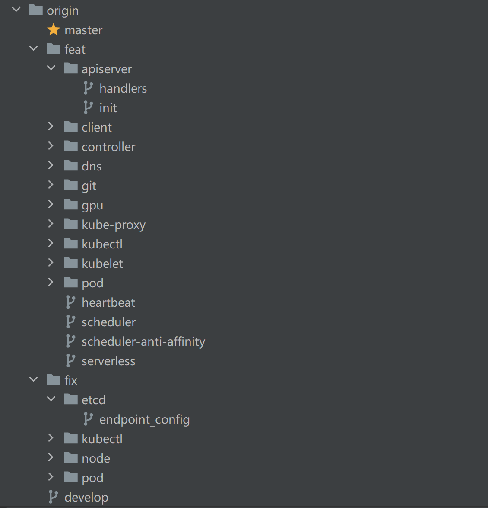

# Minik8s

Minik8s 是一个迷你的容器编排工具，能够在多机上对满足CRI接口的容器进行管理，支持容器生命周期管理、动态伸缩、自动扩容等基本功能。

# 总体架构

Minik8s 的总体架构整体上参考了课上所提供的 minik8s best practice 的架构，主要分为控制面 Master 和工作节点 Worker 两部分。

## 组件

Master

## 软件栈


# 项目信息

gitee目录地址：https://gitee.com/albus-tan/minik8s

## 开发规范

### 分支介绍

采用 [Vincent Driessen](https://nvie.com/posts/a-successful-git-branching-model/) 提出的 git branch model 进行分支管理，主要分支包括：

- `master` 分支：提供给用户使用的正式版本和稳定版本，所有版本发布和 Tag 操作都在这里进行。不允许开发者日常 push，允许从 `develop` 合并
-  `develop` 分支：日常开发的汇总分支。开发者可以检出 `feat` 和 `fix` 分支，开发完成后提出 pull request，经过 peer review 后被合并回 `develop`。不允许开发者日常直接 push，只允许完成功能开发或 bug 修复后通过 pull request 进行合并
- `feat` 分支：从 `develop` 分支检出，用于新功能开发。开发完毕，经过测试后通过 pull request 合并到 `develop` 分支，允许开发者日常 push
  - 命名为 `feat/component/detail`，如 `feat/apiserver/handlers`，表示对于 ApiServer 组件的 handlers 功能的开发分支
- `fix` 分支：从 `develop` 分支检出，用于 bug 修复（feat 过程中的 bug 直接就地解决）；修复完毕，经过测试后合并到 `develop` 分支，允许开发者日常 push
  - 命名为 `fix/component/detail`，如 `fix/etcd/endpoint_config` ，表示对于 etcd 开发时的 endpoint 配置的修复

**分支概览**



### Commit Message 规范

```
<type>: <body>
```

type 有下面几类

- `feat` 新功能
- `fix` 修补bug（在 `<body>` 里面加对应的 Issue ID）
- `test` 测试相关
- `doc` 注释/文档变化
- `refactor` 重构（没有新增功能或修复 BUG）

#### 规范自动检查

提交后会通过 `.githooks/commit-msg` 下的脚本自动检查规范

### 项目新功能开发流程

每当需要开发新功能时，小组成员会在开会讨论后，由负责功能开发的成员新建 `feat` 分支，命名为 `feat/component/detail`，并在其上进行开发。在开发完毕后负责开发的成员会提出 pull request，待至少另一名小组成员完成 peer review 审查通过后，方可 merge 进 `develop` 分支。

## CI/CD介绍

## 软件测试方法介绍

### 自动化测试

自动化测试通过撰写测试脚本后 `go test` 进行测试。主要包括针对小型组件（如 `client`）和函数（如 `ParseQuantity`）的单元测试，旨在测试组件是否依照需求工作，同时及时发现代码错误，协助开发。

此部分遵循 go 语言测试的基本原则，要求以 `*_test.go` 新建文件，并在文件中以 `TestXxx` 命名函数。然后再通过 `go test [flags] [packages]` 执行函数。

- 注意部分 `*_test.go` 文件中测试依赖于函数顺序，因此在 `go test` 时不能开并行测试，也不能调换测试函数在文件中出现的先后顺序。

### 手动测试

手动测试通过操控 `postman` 或 `kubectl` 命令行工具，以及 `example` 文件夹下撰写的 `yaml/json` 案例进行测试。主要包括针对复杂逻辑，组件间交互进行的集成测试和系统测试。

采用手动测试的核心原因是本组人手不足，为每一种功能都撰写自动化测试脚本需要较大的额外工作量。但是在开发过程中以及验收前我们对所有需求都进行了详细充分的手动测试，包括一系列可能的边界情况，能够保证所开发项目代码的质量。


# 主要功能

## API对象

API 对象的设计部分参考 kubernetes

> https://github.com/kubernetes/kubernetes/blob/master/staging/src/k8s.io/api/core/v1/types.go


# 组员分工和贡献度

- 谈子铭
  - ApiServer 及 etcd
  - ApiClient 及 ListWatcher
  - Controller 基本组件
  - ReplicaSet抽象和其基本功能
  - 动态伸缩 HPA 功能
  - 多机上实现容器编排的功能（Node 抽象与 Scheduler）
  - 完成 GPU 部分
  - DNS 及 Serverless Controller
  - CNI，CI/CD等的尝试
- 王家睿
  - 实现 Pod 抽象，对容器生命周期管理
  - 实现 kubelet 绝大部分功能
  - 实现 CNI，支持 Pod 间通信
  - 实现 Service 抽象
  - 实现 DNS 抽象
  - 部分实现转发功能
  - 实现 Serverless 功能
- 陆胤松
  - 实现 kubectl 命令行工具

# 安装教程

- Go 开发环境及 GoLand 项目配置 https://blog.csdn.net/m0_56510407/article/details/123544438
