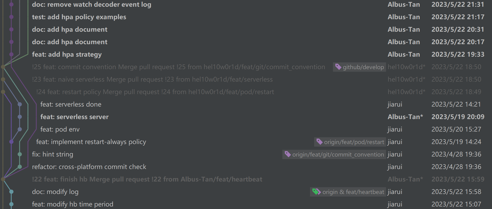

# Minik8s

Minik8s 是一个类似于 [Kubernetes](https://kubernetes.io/) 的迷你容器编排工具，能够在多机上对满足 CRI 接口的容器进行管理，支持容器生命周期管理、动态伸缩、自动扩容等基本功能，并且基于 minik8s 实现了 Serverless 平台集成。

# 目录

[TOC]

# 总体架构

Minik8s 的总体架构整体上参考了课上所提供的 minik8s best practice 的架构，主要分为控制面 Master 和工作节点 Worker 两部分。

## 架构图


## 组件

**核心组件**

- 控制面 Master
  - ApiServer：负责与各组件交互，将 API 对象持久化进入 etcd
  - Scheduler：负责新创建的 Pod 的调度
  - ControllerManager：负责管理各个 Controller
    - ReplicaSetController：负责实现并管理 ReplicaSet
    - HorizontalController：负责实现并管理 HPA
    - DnsController：负责实现并管理 Dns
    - ServerlessController：负责实现 Serverless 的函数调用及实例管理等
  - GpuServer：管理 Gpu Job
- 工作节点 Worker
  - Kubelet：在每个节点上控制管理 Pod 生命周期
  - Kubeproxy：管理节点网络以及 service
- 其他
  - Kubectl：命令行工具，用于与控制面交互
  - ApiClient：能够与 ApiServer 交互通信的 Client

**组件概览**

- **控制面 Master**
  - ApiServer：暴露 API，负责处理用户/各组件的 HTTP 请求，并将 API 对象持久化进入 etcd
    - HttpServer：负责接收用户/组件的 HTTP 请求
      - Handlers：负责调用 EtcdClient 处理用户/其他组件对 API 对象的增删改查操作
      - ServerlessFuncHandler：负责转发用户 Call 函数的请求到具体运行的函数实例，并将函数执行结果反馈给用户；同时负责实现 Serverless 的函数递归调用
    - EtcdClient：与 etcd 直接交互的 client，负责增删改查，并提供 watch 监听机制转发
  - Scheduler：负责新创建的 Pod 的调度
  - ControllerManager：负责管理各个 Controller，监控整个集群的状态，确保集群中的真实状态和期望状态一致
    - Controller 基本组件
      - Informer：Controller 本地的数据缓存，将 Object 的数据缓存在本地，只监听更新并及时同步到本地cache中
        - Reflector：负责监听更新 Object
        - ThreadSafeStore：负责 Object 的存储，线程安全
      - Workqueue：包含 Object 变化的事件，Controller 可以通过启动工作线程（可以并行处理）在 workqueue 中获取需要处理的对象并操作
    - ReplicaSetController：管理实现 ReplicaSet 功能，保证期望数量，符合 selector 条件的 Pod 实例在正常运行
    - HorizontalController：管理实现 HPA 自动扩缩容功能，通过获取各节点上资源占用进行有关决策
      - MetricsClient：聚合各节点上的资源占用（如依据一类 Pod 进行聚合）
        - CadvisorClient：与节点上的 cadvisor 进行交互，获取资源占用信息
    - DnsController：管理实现 Dns 功能
    - ServerlessController：负责实现 Serverless 函数的实例生命周期管理等
  - GpuServer：负责提交 Gpu 任务至云平台，根据配置进行脚本生成，以及下载反馈结果
    - JobClient：负责通过 ssh 与云平台进行交互
  - HeartbeatWatcher：负责监听工作节点的 heartbeat，并对状态异常的工作节点进行处理
- **工作节点 Worker**
  - HeartbeatSender：负责发送当前工作节点的 heartbeat 给 Master 控制面，告知自身状态正常
  - Kubelet：每个从节点 Node 的管理者，与主节点交互，控制管理 Pod 生命周期
    - PodManager
    - CriClient
  - Kubeproxy：管理节点网络，专门负责容器网络的部分，以及 Node 间连接，实现并管理 Service
    - ServiceManager：负责实现并管理 Service
    - IpvsClient
- 其他
  - Kubectl：命令行工具，用于与控制面交互
  - NodeManager：负责 master 及 worker 节点 node 抽象的初始化及删除等工作
  - ApiClient：能够与 ApiServer 交互通信的 Client
    - RESTClient：能够与 ApiServer 交互通信的 REST Client
    - ListerWatcher：专门负责 List 与 Watch 两个操作
  - Logger：日志管理与打印

## 软件栈

- 控制面 Master

  - ApiServer

    uuid: https://github.com/google/uuid

    gin: https://github.com/gin-gonic/gin

    etcd: https://github.com/etcd-io/etcd

  - ControllerManager

    - HorizontalController

      cadvisor: https://github.com/google/cadvisor

    - DnsController

    - ServerlessController

  - GpuServer

    goph: https://github.com/melbahja/goph

    sftp: https://github.com/pkg/sftp

- 工作节点 Worker

  - Kubelet

    docker: https://github.com/moby/moby

  - Kubeproxy

    ipvs: https://github.com/moby/ipvs

    net: https://golang.org/x/net

- 其他

  - Kubectl

    cobra: https://github.com/spf13/cobra

    viper: https://github.com/spf13/viper

    yaml: https://gopkg.in/yaml.v3


# 项目信息

gitee目录地址：https://gitee.com/albus-tan/minik8s

主要编程语言：`go 1.18`，`python`，`shell`

## 开发规范

### 分支介绍

采用 [Vincent Driessen](https://nvie.com/posts/a-successful-git-branching-model/) 提出的 git branch model 进行分支管理，主要分支包括：

- `master` 分支：提供给用户使用的正式版本和稳定版本，所有版本发布和 Tag 操作都在这里进行。不允许开发者日常 push，允许从 `develop` 合并
-  `develop` 分支：日常开发的汇总分支。开发者可以检出 `feat` 和 `fix` 分支，开发完成后提出 pull request，经过 peer review 后被合并回 `develop`。不允许开发者日常直接 push，只允许完成功能开发或 bug 修复后通过 pull request 进行合并
- `feat` 分支：从 `develop` 分支检出，用于新功能开发。开发完毕，经过测试后通过 pull request 合并到 `develop` 分支，允许开发者日常 push
  - 命名为 `feat/component/detail`，如 `feat/apiserver/handlers`，表示对于 ApiServer 组件的 handlers 功能的开发分支
- `fix` 分支：从 `develop` 分支检出，用于 bug 修复（feat 过程中的 bug 直接就地解决）；修复完毕，经过测试后合并到 `develop` 分支，允许开发者日常 push
  - 命名为 `fix/component/detail`，如 `fix/etcd/endpoint_config` ，表示对于 etcd 开发时的 endpoint 配置的修复

**分支概览**


### Commit Message 规范

```
<type>: <body>
```

type 有下面几类

- `feat` 新功能
- `fix` 修补bug（在 `<body>` 里面加对应的 Issue ID）
- `test` 测试相关
- `doc` 注释/文档变化
- `refactor` 重构（没有新增功能或修复 BUG）

#### 规范自动检查

提交后会通过 `.githooks/commit-msg` 下的脚本自动检查规范

### 项目新功能开发流程

每当需要开发新功能时，小组成员会在开会讨论后，由负责功能开发的成员新建 `feat` 分支，命名为 `feat/component/detail`，并在其上进行开发。在开发完毕后负责开发的成员会提出 pull request，待至少另一名小组成员完成 peer review 审查通过后，方可 merge 进 `develop` 分支。

**部分开发分支流**



## CI/CD介绍

## 软件测试方法介绍

### 自动化测试

自动化测试通过撰写**测试脚本**后 **`go test`** 进行测试。主要包括针对小型组件（如 `client`）和函数（如 `ParseQuantity`）的**单元测试**，旨在测试组件是否依照需求工作，同时及时发现代码错误，协助开发。

此部分遵循 go 语言测试的基本原则，要求以 `*_test.go` 新建文件，并在文件中以 `TestXxx` 命名函数。然后再通过 `go test [flags] [packages]` 执行函数。

- 注意部分 `*_test.go` 文件中测试依赖于函数顺序，因此在 `go test` 时不能开并行测试，也不能调换测试函数在文件中出现的先后顺序。

### 手动测试

手动测试通过操控 `postman` 或 `kubectl` 命令行工具，以及 `example` 文件夹下撰写的 `yaml/json` 案例进行测试。主要包括针对复杂逻辑，组件间交互进行的**集成测试**和**系统测试**。

采用手动测试的核心原因是本组人手不足，为每一种功能都撰写自动化测试脚本需要较大的额外工作量。但是在开发过程中以及验收前我们对所有需求都进行了详细充分的手动测试，包括一系列可能的边界情况，能够保证所开发项目代码的质量。


# 功能介绍

## 多机 Minik8s

### Node 抽象

Node 抽象通过 name 进行区分，需要保证不同物理实体机对应的 Node config 文件的 Name 字段在集群中全局唯一。Node 初始化时会检查当前有无 Node 与其重名，如果有，判断 config 文件是否与已有 Node 信息不同：

- 如果一致，则复用当前 Node，不再创建新 Node
- 如果不一致，报错给用户并退出；用户需要修改 config 文件的 Name 字段，或通过 put 方式修改原有 Node 的配置文件相关内容，以实现配置的修改

Node 抽象可以通过类型为 Node 的 yaml 配置文件来指定，示例如下：

```yaml
apiVersion: v1
kind: Node
metadata:
  labels:
    beta.kubernetes.io/arch: amd64
    beta.kubernetes.io/os: linux
    kubernetes.io/arch: amd64
    kubernetes.io/hostname: node1
    kubernetes.io/os: linux
  name: node1
spec:
  podCIDR: 10.244.1.0/24
  podCIDRs:
  - 10.244.1.0/24
```

#### Heartbeat 心跳机制

通过 worker 节点不断向 master 控制面发送 heartbeat，来告知控制面 worker 节点当前状态。如果一段时间 master 控制面没有接收到某一 worker 节点的心跳，就认为该节点异常，会将其删除。

**实现简述**

所有 worker 节点启动后，会由 Heartbeat Sender 持续向 Master 节点的 Heartbeat Watcher 发送心跳，一旦  Heartbeat Watcher 一段时间没有接收到 worker 节点发来的心跳，就认为对应 worker 节点挂掉，并将其信息在 etcd 内删除。

### Scheduler：Pod 调度

调度器监听 Pod 创建事件（Create），之后通过具体的调度策略为 Pod 绑定将要调度到的物理节点 Node，通过 Put 更新 Pod Spec 中的 Node name 字段为所绑定的物理节点名称实现调度。之后对应物理节点上的 Kubelet 会监听到 Pod 修改事件（Modify），发现是新调度至自己节点的 Pod，就会实际创建并运行 Pod。

#### 调度策略

调度器共支持三种调度策略，分别为 `NodeAffinity`，`PodAntiAffinity` 与 `Round Robin`

-  `NodeAffinity`：Pod 可以直接指定希望在哪个 Node 上运行（通过在 yaml 配置文件中指定 Node name）
-  `PodAntiAffinity`：Pod 可以指定和拥有某种 label 的 Pod 不运行在相同的 Node 上；调度时会尽可能满足 Pod 的 AntiAffinity 需求，当然如果当前所有 Node 都不能满足（比如所有 Node 上都跑了所指定的不能与其一同运行的 Pod），则此配置不生效
-  `Round Robin`：新来的 Pod 依次轮流调度到各个 Node 上；期间通过 `NodeAffinity` 调度的 Pod 不会影响 RR 队列，通过 `PodAntiAffinity` 调度的 Pod 会将被调度到的节点置于 RR 队列的末尾

**Pod 反亲和性配置案例**

```yaml
apiVersion: v1
kind: Pod
metadata:
  labels:
    app: myapp
    tier: frontend
    scheduleAntiAffinity: large
  name: myapp-schedule-large
  namespace: default
spec:
  affinity:
    podAntiAffinity:
      requiredDuringSchedulingIgnoredDuringExecution:
      - labelSelector:
          matchLabels:
            scheduleAntiAffinity: tiny
  containers:
  - image: nginx
    imagePullPolicy: Always
    name: nginx
    ports:
    - containerPort: 80
      protocol: TCP
    resources: {}
  restartPolicy: Always
```

通过其中 `affinity` 字段 `podAntiAffinity` 下的 `requiredDuringSchedulingIgnoredDuringExecution` 配置反亲和性。具体而言，配置中 `labelSelector` 表明不希望调度到有对应 `matchLabels` 标签的 Pod 的 Node 节点。

#### 调度逻辑

1. 在调度时，会首先判断新创建的 Pod 有无指定 `NodeAffinity`（通过 Pod 的 Spec 中 Node name 字段），如果有则直接调度至对应 node，无则判断有无指定 `PodAntiAffinity`
2. 如果指定了 `PodAntiAffinity`，会尝试采用此策略进行调度；否则直接采用默认的 `Round Robin` 策略调度
   -  `PodAntiAffinity` 中会通过新创建 Pod 的 label selector 判断各个 Node 上现有的 Pod 的 label 是否与其相符，来决定新 Pod 不能调度到哪些 Node 上；如果所有 Node 都被排除，会无视反亲和性配置，采用  `Round Robin` 进行调度
   -  如果通过 `PodAntiAffinity` 调度成功，会将 RR 队列中对应的 Node 移到末尾
3. `Round Robin` 策略通过维护一个 Node 队列实现，每次调度时取队首 Node ，之后将对应 Node 放置队尾，实现 RR 目的

## Pod 抽象及容器生命周期管理

### Pod 间通信


## Service


## ReplicaSet：Pod 数量控制

支持 ReplicaSet 抽象。ReplicaSet 对 Pod 指定一定数目的期望数量（`replicas`），并且监控这些 Pod 的状态。当 Pod 异常（发生 crash 或者被 kill 掉）时，会自动根据 Pod Spec 模板启动新 Pod（或接管已有的 `label` 符合对应 `selector` 条件的 Running Pod），使得 ReplicaSet 管理的 Pod 数量（同时 `label` 符合对应 `selector` 条件）恢复到 `replicas` 指定的数目。

该配置可以通过类型为 ReplicaSet 的 yaml 配置文件来指定，示例如下：

```yaml
apiVersion: apps/v1
kind: ReplicaSet
metadata:
  labels:
    app: myapp
    tier: frontend
  name: myapp-replicas
  namespace: default
spec:
  replicas: 3
  selector:
    matchLabels:
      tier: frontend
  template:
    metadata:
      labels:
        app: myapp
        tier: frontend
    spec:
      containers:
        - image: nginx
          imagePullPolicy: Always
          name: nginx
          ports:
            - containerPort: 80
              protocol: TCP
          resources: {}
      restartPolicy: Always
```

**主要功能**

此功能主要由 ReplicaSet Controller 负责，其维护与 `selector` `matchLabels` 标签匹配的 `replicas` 数量的 Pod，多删少增。

当创建 ReplicaSet 时，如果已经有 Pod，并且其 `label` 匹配 ReplicaSet 的 `selector`，ReplicaSet 会直接接管这些 Pod；此后没有这样满足要求的 Pod 才会根据其中的模板 `template` 字段创建新的 Pod。

对于原本受到 ReplicaSet 管理的 Pod 的 `label` 发生更新时，会重新检查是否符合 ReplicaSet 的 `selector` 匹配，否的话会新接管/创建 Pod。

## Auto scaling：动态伸缩

支持 HPA（`HorizontalPodAutoscaler`）抽象，可以根据其管理的 ReplicaSet 所管理的所有 Pod 中任务的实时负载，对 ReplicaSet `replicas` 数量进行动态扩容和缩容，使 ReplicaSet 所管理的所有 Pod 占用的资源量满足给出的限制。Pod 中任务的实时负载通过每个物理机节点上的 cadvisor 进行实时监控和数据收集（目前支持 cpu 和内存占用指标）。

用户可以在配置文件自定义所要监控的资源指标及相应的扩缩容标准，包括 CPU 使用率和内存使用率。用户也可以在配置文件中自定义扩缩容策略，以限制扩缩容速度和方式。

该配置可以通过类型为 HorizontalPodAutoscaler 的 yaml 配置文件来指定，示例如下：

```yaml
apiVersion: autoscaling/v2beta2
kind: HorizontalPodAutoscaler
metadata:
  name: hpa-practice-cpu-policy-scale-up
spec:
  minReplicas: 3
  maxReplicas: 6
  metrics:
  - type: Resource
    resource:
      name: cpu
      target:
        type: Utilization
        averageUtilization: 20
  - type: Resource
    resource:
      name: memory
      target:
        type: Utilization
        averageUtilization: 20
  scaleTargetRef:
    apiVersion: apps/v1
    kind: ReplicaSet
    name: myapp-replicas
  behavior:
    scaleUp:
      selectPolicy: Max
      stabilizationWindowSeconds: 0
      policies:
      - type: Pods
        value: 1
        periodSeconds: 15
```

**主要功能**

- 扩缩容：以扩容为例，HPA 的目标 ReplicaSet 管理的 Pod 负载增加时，如果达到扩容策略 metrics 规定的值，HPA 会增加 Pod 数量（通过修改所管理的 ReplicaSet Spec 的 `replicas` 字段实现），最大会增加到 `maxReplicas`。缩容同理。
- 与 ReplicaSet 一样，扩缩容所新创建的 Pod 将分布在不同节点中。
- 扩缩容策略：用户可自定义扩缩容策略，包括对扩缩容的速度限制，时间间隔限制等

**字段意义**

其中各个字段意义如下：

- `minReplicas`：HPA 自动扩缩时最少能缩小到多少 `replicas`
- `maxReplicas`：HPA 自动扩缩时最多能扩增到多少 `replicas`
- `metrics`：扩缩容决策所依据的资源指标；定义了在当前资源指标的量化标准下，应该怎么 scale
  - `type`：资源指标类型，目前仅支持 `Resource`
  - `resource`：Resource 资源指标信息
    - `name`：资源名称，目前支持 `cpu` 和 `memory`
    - `target`：资源的目标值
      - `type`：目前支持 `AverageValue` 和 `Utilization`
      - `averageValue`：指标的目标值（对于所有相关 Pod 计算该指标平均值）
      - `averageUtilization`：指标的目标值，百分比表示（对于所有相关 Pod 计算该指标平均值）
- `scaleTargetRef`：HPA 控制的对象，当前仅支持 ReplicaSet
- `behavior`：扩缩容策略，其中 `scaleUp` 与 `scaleDown` 分别配置扩容与缩容策略
  - `stabilizationWindowSeconds`：从上一次 auto scale 事件开始必须经过 `stabilizationWindowSeconds` 的秒数，才可以进行下一次的自动 scale
  - `selectPolicy`：对所配置策略组 `Policies` 中各个 policy 结果如何综合（每个 policy 规范 scale 所扩/缩的 Pod 数量应当不大于多少）
    - `Max`：从 Policies 的所有 Policy 中选出扩/缩的 Pod 数量最多的
    - `Min`：从 Policies 的所有 Policy 中选出扩/缩的 Pod 数量最少的
    - `Disabled`：禁止这一维度的 scale（也即不允许自动扩容 `ScaleUp` 或自动缩容 `ScaleDown` ）
  - `policies`：具体策略（数组，可配置多个）
    - `type`：
      - `Pods`：表示 scale 所对 Pod 数量做的变化 delta 需要小于等于 `Value` 的数值（限定变化的绝对数量）
      - `Percent`：此时 `Value` 对应 0 至 100，表示百分之几；表示 scale 所对 Pod 数量做的变化 delta 需要小于等于当前现有 Pod 数量的百分之多少（如 Value 为 100，则 scale 的增/减数量至多为当前 Pod 数量个 Pod，也即至多倍增/全删）
    - `PeriodSeconds`：从上一次 auto scale 事件开始必须经过 `PeriodSeconds` 的秒数，此 Policy 才可以生效

**扩缩容默认策略**

如果配置文件中未定义策略，则默认如下：

- 扩容：当资源指标满足需要扩容的条件时，在以下两个原则中取高值扩容，允许至多扩容至 `maxReplicas` 数量
  - 每 15 秒至多增加 1 个 Pod
  - 每 60 秒至多倍增 Pod 数量至当前数量的两倍
  - `stabilizationWindowSeconds` 为 0
- 缩容：当资源指标满足需要缩容的条件时，允许至多缩小至 `minReplicas` 数量
  - 每 15 秒至多减少 100 个 Pod
  - `stabilizationWindowSeconds` 为 300

**实现原理**

- 实际资源使用情况信息的收集与监控：每个物理节点上部署了 cadvisor，用于监控当前节点上实时的 CPU 和内存资源占用信息（包括物理机的总资源信息和每个容器的占用信息）。同时控制面中的 HPAController 会通过 cadvisor client 与其交互，每次需要相应信息时就发起请求，收集最近一段时间内的资源占用 status 情况（包括若干个时间点的采样指标）
- 使用信息整合：控制面中的 HPAController 下的 Mertic Client 会将这些各容器资源占用信息按照 Pod 进行整合，从而得知 Pod 实际资源使用
- 扩缩容决策：HPAController 通过 Pod 实际资源使用得到 ReplicaSet 的实际资源使用，并依据对应 HPA 中的资源占用要求进行决策，决定是否扩缩容
- 扩缩容执行：如果决定扩缩容，则按照相应的扩缩容策略执行，也即通过修改所管理的 ReplicaSet Spec 的 `replicas` 字段实现

## DNS 与转发

## 容错

## GPU 应用支持

支持用户编写 CUDA 程序的 GPU 应用，并帮助用户将 CUDA 程序提交至[交我算平台](https://docs.hpc.sjtu.edu.cn/index.html)编译和运行。

用户只需要编写 CUDA 程序，并通过 yaml 配置文件提交对应 Job，Minik8s 会通过内置的 server 自动生成 slurm 脚本，并将程序上传至交我算平台编译运行。在任务执行完后 Minik8s 会自动下载结果到用户端，同时可配置通过交大邮箱通知用户。

该配置可以通过类型为 Job 的 yaml 配置文件来指定，示例如下：

```yaml
apiVersion: v1
kind: Job
metadata:
  name: matrix-sum
  namespace: default
spec:
  cuFilePath: D:\SJTU\Minik8s\minik8s\pkg\gpu\cuda\sum_matrix\sum_matrix.cu
  resultFileName: sum_matrix
  resultFilePath: D:\SJTU\Minik8s\minik8s\pkg\gpu\cuda\sum_matrix
  args:
    numTasksPerNode: 1
    cpusPerTask: 2
    mail:
      type: all
      userName: albus_tan
```

**主要功能**

- 用户可以通过编写 Job 类型的 yaml 配置文件提交运行编写的 CUDA 程序
- 根据 yaml 配置文件自动生成 slurm 脚本，并将用户编写的 CUDA 程序上传至交我算平台编译运行
- 可配置每节点核数，任务能使用的 CPU，GPU 数量等
- 提交成功后，可以通过 get job 方法得到当前 Job 的实时执行状态（Pending，Running，Failed，Completed）
- 支持任务开始时/完成后通过交大邮箱通知用户
- 任务完成后，自动将结果下载至用户端指定的目录中

**字段意义**

- `cuFilePath`：用户想要提交的 CUDA 程序的路径
- `resultFileName`：执行结果的文件名
- `resultFilePath`：执行结果下载至本地的路径
- `args`：任务可配置参数
  - `numTasksPerNode`：每节点核数
  - `cpusPerTask`：使用 CPU 数量
  - `gpuResources`：使用 GPU 数量
  - `mail`：任务状态改变时通过交大邮箱通知用户
    - `type`：支持 begin（任务开始时通知），end（任务结束时通知），fail（任务失败时通知），all（任务状态变化时通知）
    - `userName`：用户的交大邮箱用户名，如此处填写 `albus_tan`，则会将通知邮件发送至 `albus_tan@sjtu.edu.cn`

**实现原理**

- 任务提交：server 监听 Job 创建事件，之后通过 ssh client，连接登录交我算 π 2.0 集群，使用 CUDA 编译 .cu 文件，并提交 dgx2 队列作业（GPU 任务队列）
- 任务状态获取：server 后台线程每隔一段时间通过 squeue 命令和 sacct 命令查看作业的状态，并修改对应 Job 的 status 字段
- 自动结果下载：server 后台线程监听 Job 修改，当发现 Job status 对应字段显示 Job 完成，通过 sftp 从交我算平台下载对应 Job 结果文件夹中的执行结果到本地目标路径

**矩阵乘法和加法程序**


`blockIdx` 代表一个 block 的坐标，例如，左上角的块的坐标为 `blockIdx(0,0)`；`blockDim` 代表一个 `block` 的尺寸，一个 `block` 是二维的，`blockDim.x` 代表宽度，`blockDim.y` 代表高度。`threadIdx` 代表一个 block 内线程的坐标，与 `blockIdx` 类似。将 CUDA 网格（grid）中的每个块都对应于矩阵中的一个区域，也即可以将块（block）中的一个单元映射到矩阵中的一个元素：

```c++
int i = blockIdx.x * blockDim.x + threadIdx.x;
int j = blockIdx.y * blockDim.y + threadIdx.y;
```

在 GPU 上执行的函数称为 CUDA 核函数，核函数会被 GPU 上多个线程并行执行，用 `__global__` 声明，在调用时需要用 `<<\>>` 来指定 kernel 要执行的线程数量和维度结构。

矩阵加法 CUDA 核函数：

```c++
__global__ void matrix_add(int **A, int **B, int **C) {
    int i = blockIdx.x * blockDim.x + threadIdx.x;
    int j = blockIdx.y * blockDim.y + threadIdx.y;
    C[i][j] = A[i][j] + B[i][j];
}
```

矩阵乘法 CUDA 核函数：

```c++
__global__ void matrix_multiply(int **A, int **B, int **C) {
    int i = blockIdx.x * blockDim.x + threadIdx.x;
    int j = blockIdx.y * blockDim.y + threadIdx.y;
    int value = 0;
    for (int k = 0; k < N; k++) {
        value += A[i][k] * B[k][j];
    }
    C[i][j] = value;
}
```

以矩阵乘法为例，调用方法如下（结果为 M*M 的矩阵），每一个线程运算结果矩阵的一个元素：

```c++
dim3 threadPerBlock(5, 5);
dim3 numBlocks(M / threadPerBlock.x, M / threadPerBlock.y);
matrix_multiply <<<numBlocks, threadPerBlock>>> (dev_A, dev_B, dev_C);
```

## Serverless


# 实现简述

## 相关实现文档

实现部分的文档可以参考以下链接：

- [API & API 对象](./doc/API.md)
- [ApiServer, ApiClient 及 ListWatch](./doc/ApiServer.md)
- [Scheduler](./doc/Scheduler.md)
- [Controller（Informer, ReplicaSetController 及 HorizontalController）](./doc/Controller.md)
- [Gpu Server](./doc/GPU.md)
- [Kubelet](./doc/Kubelet.md)
- Kubeproxy
- [Serverless](./doc/Serverless.md)
- [Node Manager](./doc/Node.md)
- [CI/CD](./doc/CI CD.md)
- [CNI](./doc/CNI.md)
- [Test](./doc/Test.md)

## 实现亮点

### ApiServer

#### Concurrency Control and Consistency 乐观并发控制

API 对象资源更新时支持 ResourceVersion 检查，避免了多个组件/用户同时更新同一个对象资源时可能的并发问题，如两个组件同时基于同一版本的对象更新了某对象的 A 与 B 字段，之后 Put 时后更新的就会将先更新的字段覆盖，从而导致部分字段的更新遗漏。

> Ref：https://github.com/kubernetes/community/blob/master/contributors/devel/sig-architecture/api-conventions.md#concurrency-control-and-consistency

参照 Kubernetes 的实现，所有资源都有一个 `resourceVersion` 字段，作为其元数据的一部分。这个 ResourceVersion 是一个字符串，它标识了一个对象的内部版本，可以被客户端用来确定对象何时改变。当一条记录要被更新时，它的版本会与一个预先保存的值进行核对，如果不匹配，更新就会以 StatusConflict（HTTP状态码409）失败。

资源版本目前是由 [etcd 的 mod_revision](https://etcd.io/docs/latest/learning/api/#key-value-pair) 支持的。然而，需要注意的是，应用程序不应该依赖所维护的版本系统的实现细节。我们可能会在未来改变资源版本的实现，比如把它改成一个时间戳或每个对象的计数器。

由于 mod revision 在对 etcd 的 Put 操作后才能获取到，同时需要将这个 revision 写入 API 对象自身的 ResourceVersion 字段，实现时需要注意同步维护全局 revision 号（通过 `ResourceVersionManager` 维护），并且保证获取下一次 mod revision，写入 API 对象自身的 ResourceVersion 字段，存储 API 对象这一系列 Get version，Set version，Store Object 操作同一时刻只能有一个在发生。实现时添加锁 `VLock` 来保障这一点。

### ListWatch

通过 `client.Interface` 创建，封装接口为 `ListWatcher`，专门用来调用对应资源的 `GetAll` 与 `WatchAll` 方法。

#### Watch 监听机制

可以对某个/种 API 对象进行监听，当其发生创建，修改或者删除时，获得通知。

- 在 watch 请求后建立 http 长连接，通过 `http.Flusher` 将 event 实时刷新给请求者，而不用断开重连。
- 内部通过 `etcd` 的 `Watch` 机制实现。对某个 `key` 进行监听，每当对应 `value` 发生修改，就会通过 channel 进行通知。 `etcd` 的 `Watch` 在键值对被删除时响应 value 为 `“”`，考虑到许多组件需要获取被删除前的内容，因此使用 `clientv3.WithPrevKV()` 添加这个字段。

#### StreamWatcher

`ListWatcher` 接口的实现，需要对资源进行 List 和 Watch 操作的组件可以通过 `ListWatcher` 轻松的实现监听：

- `Decoder`：负责将 `Watch` 监听到的 `ApiServer` 发来的事件类型转换为 `watch.Event` 类型
  - 此处 `ApiServer` 发来的事件类型为 `Etcd` 内置事件类型，这么做的好处在于解耦，修改实现只需要实现对应 `Decoder interface` 接口即可
- `Reporter`：错误处理，将报告错误的事件转换为标准的 `watch.Event` 类型，同时也将过程中产生的错误 转换为标准的 `watch.Event` 类型
- `chan Event`：通过此通道将监听到的事件发送出去，使用 `StreamWatcher` 的组件可以通过 `watch.Interface` 中的 `ResultChan()` 拿到这个通道，并获取事件；通道使用完成后/结束时需要通过 `Stop()` 方法关闭通道

### Controller

参照 Kubernetes，实现了 Informer 和 WorkQueue 两个基本组件，方便所有 Controller 的实现。

#### Informer 本地缓存

相当于每个 Node 上对于不同 ApiObject 的本地缓存，避免频繁向 ApiServer 发送网络请求，可以很大程度上提升性能。每一种 ApiObject 资源对应一个 Informer（由 `objType` 指定）。启动时其中的 `Reflector` 通过 `List` 向 ApiServer 拿取所有 ApiObject 信息，并且存储在 `ThreadSafeStore` 中。之后其 `Reflector` 通过 `Watch` 监听所有对应 ApiObject 的变化事件，并存储在 `ThreadSafeStore` 中，同时调用注册进来的 `ResourceEventHandler` 进行相应处理。

- `Reflector`：启动时先通过 `List` 向 ApiServer 拿取所有 ApiObject 信息，并且存储在 `ThreadSafeStore` 中，之后通过 `Watch` 监听所有对应 ApiObject 的变化事件，并通知  `Informer` （通过将事件放入 `WorkQueue`）；其中 `List` 与 `Watch` 都由 `listwatch.ListerWatcher` 组件完成
- `ThreadSafeStore`：与其 `Reflector` 共享同一个存储，存储对应 ApiObject 对象的本地缓存
- `ResourceEventHandler`：注册对于各种 `Watch` 事件的响应，使用 `Informer` 的组件可以通过 `AddEventHandler ` 添加对应处理函数
- `WorkQueue`：每次 `Reflector` 监听到新事件，就放进此队列，等待 `Informer` 在 `run` 中进行处理，并调用相应注册进来的 `EventHandler` 函数

#### WorkQueue 工作队列

工作队列可以允许 controller 中多个 worker 同时消费对象相关事件，实现处理并行化，提升性能。

- 线程安全的队列，通过读写锁允许多个线程同时处理而不出现并发问题
- 在 `Dequeue` 时如果队列为空，会通过 Conditional Variable 等待 `Enqueue` 操作唤醒，再尝试进行 `Dequeue`

# 组员分工和贡献度

- 谈子铭
  - ApiServer 及 etcd
  - ApiClient 及 ListWatcher
  - Controller 基本组件
  - ReplicaSet抽象和其基本功能
  - 动态伸缩 HPA 功能
  - 多机上实现容器编排的功能（Node 抽象与 Scheduler）
  - 完成 GPU 部分
  - DNS 及 Serverless Controller
  - CNI，CI/CD等的尝试
- 王家睿
  - 实现 Pod 抽象，对容器生命周期管理
  - 实现 kubelet 绝大部分功能
  - 实现 CNI，支持 Pod 间通信
  - 实现 Service 抽象
  - 实现 DNS 抽象
  - 部分实现转发功能
  - 实现 Serverless 功能
- 陆胤松
  - 实现部分 kubectl 命令行工具


# 安装教程

- Go 开发环境及 GoLand 项目配置 https://blog.csdn.net/m0_56510407/article/details/123544438

## etcd

控制面 Master 节点上需要安装 etcd

> 最新版本见 **[etcd](https://github.com/etcd-io/etcd)**，下载安装方式见 [install](https://etcd.io/docs/v3.5/install/)

## Cadvisor

每个 Worker 节点上需要安装部署 cadvisor，并在启动前启动，方可正常使用 HPA 功能

**使用二进制部署**

```sh
# 下载二进制
https://github.com/google/cadvisor/releases/latest
# 本地运行
./cadvisor  -port=8090 &>>/var/log/cadvisor.log
# 查看进程信息
ps -aux | grep cadvisor
# 查看端口占用
netstat -anp | grep 8090
```

**使用docker部署**

```bash
docker run \
--volume=/:/rootfs:ro \
--volume=/var/run:/var/run:rw \
--volume=/sys:/sys:ro \
--volume=/var/lib/docker/:/var/lib/docker:ro \
--volume=/dev/disk/:/dev/disk:ro \
--publish=8090:8090 \
--detach=true \
--name=cadvisor \
google/cadvisor:latest
```

**端口转发**

这样在本机上就可以看到远端机器上的 cadvisor

```
ssh -N minik8s-dev -L 8090:localhost:8090
```

## Flannel

每个节点都需要通过 flannel 进行网络配置。

Flannel配置第3层IPv4  overlay网络。它会创建一个大型内部网络，跨越集群中每个节点。在此overlay网络中，每个节点都有一个子网，用于在内部分配IP地址。在配置pod时，每个节点上的Docker桥接口都会为每个新容器分配一个地址。同一主机中的Pod可以使用Docker桥接进行通信，而不同主机上的pod会使用flanneld将其流量封装在UDP数据包中，以便路由到适当的目标。

**参考 [Running flannel](https://github.com/flannel-io/flannel/blob/master/Documentation/running.md) Running manually 章节**

若 wget 失败可以考虑手动上传文件到服务器

```bash
sudo apt install etcd
wget https://github.com/flannel-io/flannel/releases/latest/download/flanneld-amd64 && chmod +x flanneld-amd64
sudo ./flanneld-amd64
```

```bash
docker run --rm --net=host quay.io/coreos/etcd
```

```bash
docker run --rm -e ETCDCTL_API=3 --net=host quay.io/coreos/etcd etcdctl put /coreos.com/network/config '{ "Network": "10.5.0.0/16", "Backend": {"Type": "vxlan"}}'
```

**查看端口占用**

```bash
netstat -nap | grep 2380
```

**测试**

```bash
docker run -it  busybox sh
# 查看容器IP
$ cat /etc/hosts
# ping
ping -c3  10.0.5.2
```

