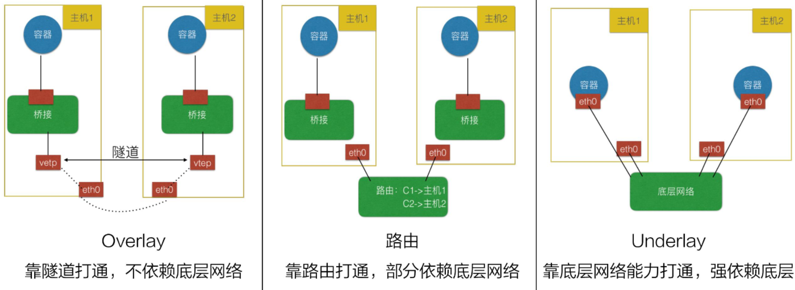

# CNI（Container Network Interface）

 CNI，全称 Container Network Interface，即容器网络的 API 接口。

它是 K8s 中标准的一个调用网络实现的接口。Kubelet 通过这个标准的 API 来调用不同的网络插件以实现不同的网络配置方式。实现了这个接口的就是 CNI 插件，它实现了一系列的 CNI API 接口。常见的 CNI 插件包括 Calico、flannel、Terway、Weave Net  以及 Contiv。

## CNI 插件分类



- **Overlay 模式**的典型特征是容器独立于主机的 IP 段，这个 IP 段进行跨主机网络通信时是通过在主机之间创建隧道的方式，将整个容器网段的包全都封装成底层的物理网络中主机之间的包。该方式的好处在于它不依赖于底层网络
- **路由模式**中主机和容器也分属不同的网段，它与 Overlay 模式的主要区别在于它的跨主机通信是通过路由打通，无需在不同主机之间做一个隧道封包。但路由打通就需要部分依赖于底层网络，比如说要求底层网络有二层可达的一个能力
- **Underlay 模式**中容器和宿主机位于同一层网络，两者拥有相同的地位。容器之间网络的打通主要依靠于底层网络。因此该模式是强依赖于底层能力的

## Flannel

Flannel配置第3层IPv4  overlay网络。它会创建一个大型内部网络，跨越集群中每个节点。在此overlay网络中，每个节点都有一个子网，用于在内部分配IP地址。在配置pod时，每个节点上的Docker桥接口都会为每个新容器分配一个地址。同一主机中的Pod可以使用Docker桥接进行通信，而不同主机上的pod会使用flanneld将其流量封装在UDP数据包中，以便路由到适当的目标。

https://blog.csdn.net/xixihahalelehehe/article/details/115462466

[https://www.cni.dev/docs/cnitool/](https://link.zhihu.com/?target=https%3A//www.cni.dev/docs/cnitool/) 

**参考 [Running flannel](https://github.com/flannel-io/flannel/blob/master/Documentation/running.md) Running manually 章节**

若 wget 失败可以考虑手动上传文件到服务器

```bash
sudo apt install etcd
wget https://github.com/flannel-io/flannel/releases/latest/download/flanneld-amd64 && chmod +x flanneld-amd64
sudo ./flanneld-amd64
```

```bash
docker run --rm --net=host quay.io/coreos/etcd
```

```bash
docker run --rm -e ETCDCTL_API=3 --net=host quay.io/coreos/etcd etcdctl put /coreos.com/network/config '{ "Network": "10.5.0.0/16", "Backend": {"Type": "vxlan"}}'
```

**查看端口占用**

```bash
netstat -nap | grep 2380
```

**测试**

```bash
docker run -it  busybox sh
# 查看容器IP
$ cat /etc/hosts
# ping
ping -c3  10.0.5.2
```

## [go-cni](https://github.com/containerd/go-cni)

A generic CNI library to provide APIs for CNI plugin interactions. 

# Ref

1. [理解CNI和CNI插件](https://blog.csdn.net/fly910905/article/details/123487581)
2. [kubernetes 【CNI插件】Flannel使用详解](https://blog.csdn.net/xixihahalelehehe/article/details/115462466)
3. [cni 插件flannel-vxlan使用流程实操](https://zhuanlan.zhihu.com/p/506644886)